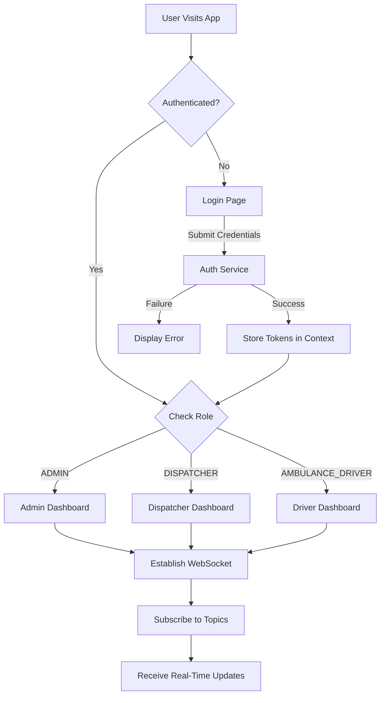
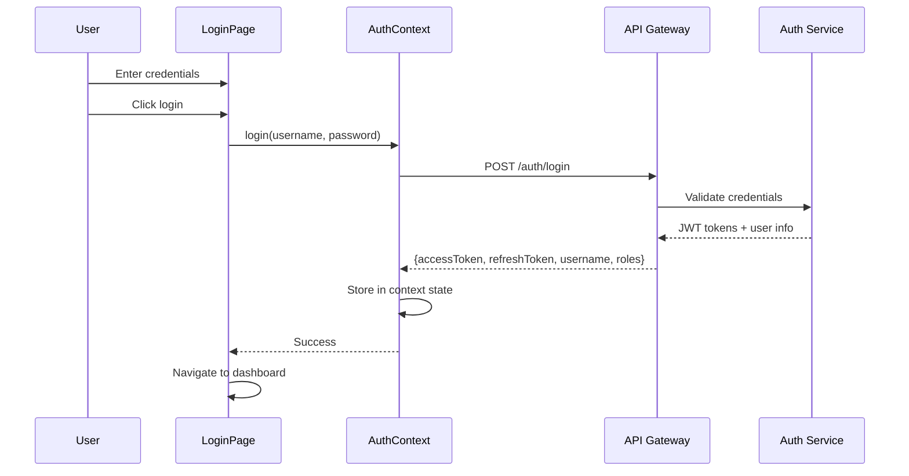
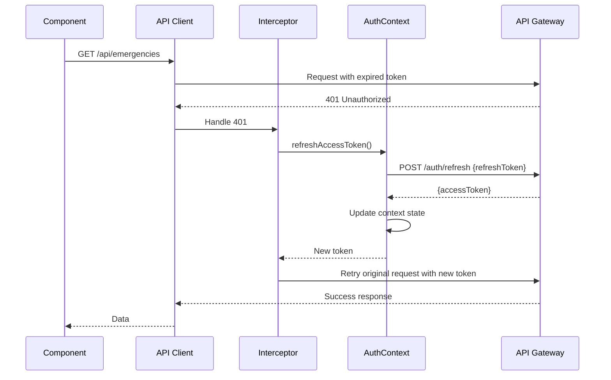
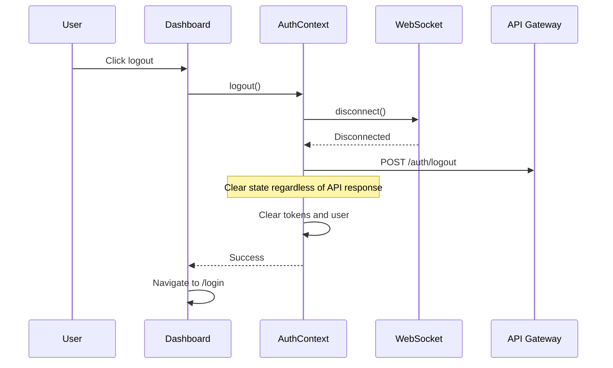
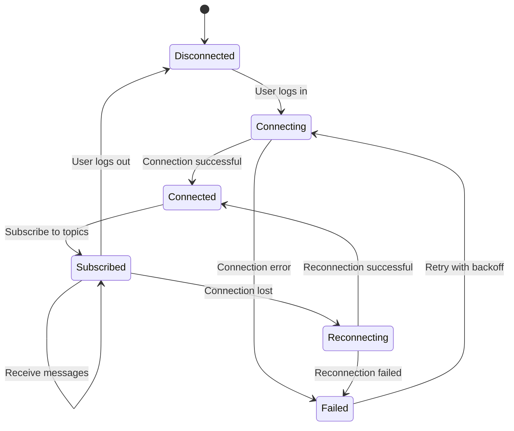
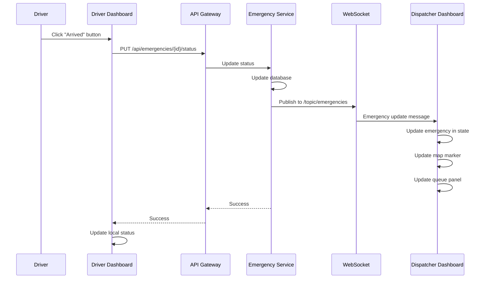
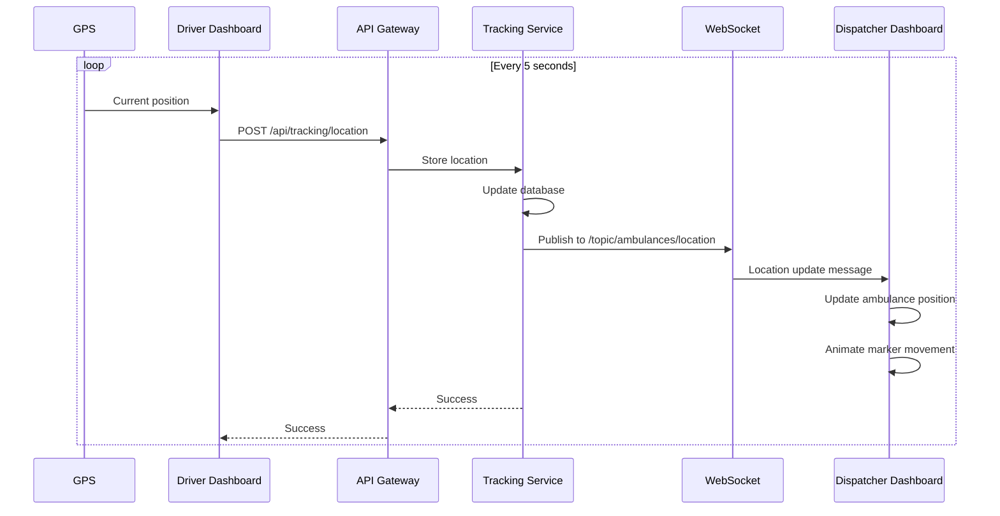

# Design Document: Frontend Authentication and Dashboards

## Overview

This design document specifies the architecture and implementation approach for a production-ready React frontend for the Emergency Dispatch System. The system provides JWT-based authentication, role-based access control, and three distinct dashboard experiences for Admin, Dispatcher, and Ambulance Driver users.

### Key Design Goals

1. **Security-First Architecture**: All API communication flows through the API Gateway with JWT authentication, automatic token refresh, and role-based authorization
2. **Real-Time Responsiveness**: WebSocket integration provides live updates for emergency status, ambulance locations, and fleet changes
3. **Role-Appropriate UX**: Each user role receives a tailored interface optimized for their specific workflows and information needs
4. **Maintainable Codebase**: Unified API service layer, consistent error handling patterns, and clear component hierarchy
5. **Mobile-First Driver Experience**: Touch-optimized interface for field operations with minimal cognitive load

### Technology Stack

- **Framework**: React 18 with functional components and hooks
- **State Management**: React Context API for authentication state, local component state for UI
- **Routing**: React Router v6 for role-based navigation
- **HTTP Client**: Axios with interceptors for authentication and error handling
- **WebSocket**: STOMP over SockJS for real-time bidirectional communication
- **Mapping**: Leaflet with React-Leaflet for interactive maps
- **UI Components**: Custom components with Tailwind CSS for styling
- **Build Tool**: Vite for fast development and optimized production builds

## Architecture

### High-Level Component Structure

```
Frontend Application
├── Authentication Layer
│   ├── Login Page
│   ├── Auth Context Provider
│   └── Protected Route Wrapper
├── API Service Layer
│   ├── HTTP Client (Axios)
│   ├── Token Interceptor
│   └── Typed API Functions
├── WebSocket Service
│   ├── STOMP Client
│   ├── Topic Subscriptions
│   └── Message Handlers
├── Dashboard Layer
│   ├── Admin Dashboard
│   │   ├── Dispatcher Features (inherited)
│   │   ├── Fleet Management Panel
│   │   ├── System Health Panel
│   │   └── Metrics Link
│   ├── Dispatcher Dashboard
│   │   ├── Live Map Component
│   │   ├── Emergency Creation Panel
│   │   ├── Emergency Queue Panel
│   │   └── Fleet Status Panel
│   └── Driver Dashboard
│       ├── Mission Display
│       ├── Status Controls
│       └── Location Tracker
└── Shared Components
    ├── Map Components
    ├── Toast Notifications
    ├── Loading Indicators
    └── Error Boundaries
```

### Application Flow



## Components and Interfaces

### Authentication Components

#### AuthContext

Provides global authentication state and operations throughout the application.

**State Shape**:
```typescript
interface AuthState {
  isAuthenticated: boolean;
  user: {
    username: string;
    roles: string[];
  } | null;
  accessToken: string | null;
  refreshToken: string | null;
}

interface AuthContextValue extends AuthState {
  login: (username: string, password: string) => Promise<void>;
  logout: () => Promise<void>;
  refreshAccessToken: () => Promise<string>;
}
```

**Responsibilities**:
- Maintain authentication state in memory (no localStorage)
- Provide login/logout functions to child components
- Expose token refresh function for API interceptor
- Trigger navigation on authentication state changes

#### LoginPage Component

**Props**: None (uses AuthContext)

**State**:
```typescript
interface LoginState {
  username: string;
  password: string;
  isLoading: boolean;
  error: string | null;
}
```

**Behavior**:
- Renders username and password input fields
- Calls `authContext.login()` on form submission
- Displays loading spinner during authentication
- Shows error messages from failed login attempts
- Redirects to role-appropriate dashboard on success

#### ProtectedRoute Component

**Props**:
```typescript
interface ProtectedRouteProps {
  children: React.ReactNode;
  requiredRoles?: string[];
}
```

**Behavior**:
- Checks `authContext.isAuthenticated` before rendering children
- Redirects to `/login` if not authenticated
- Checks user roles against `requiredRoles` if specified
- Redirects to authorized dashboard if role mismatch
- Renders children if all checks pass

### API Service Layer

#### API Client Configuration

**Base Configuration**:
```typescript
const apiClient = axios.create({
  baseURL: 'http://localhost:8080',
  timeout: 10000,
  headers: {
    'Content-Type': 'application/json',
  },
});
```

**Request Interceptor**:
```typescript
apiClient.interceptors.request.use((config) => {
  const token = authContext.accessToken;
  if (token) {
    config.headers.Authorization = `Bearer ${token}`;
  }
  return config;
});
```

**Response Interceptor** (Token Refresh Logic):
```typescript
apiClient.interceptors.response.use(
  (response) => response,
  async (error) => {
    const originalRequest = error.config;
    
    if (error.response?.status === 401 && !originalRequest._retry) {
      originalRequest._retry = true;
      
      try {
        const newToken = await authContext.refreshAccessToken();
        originalRequest.headers.Authorization = `Bearer ${newToken}`;
        return apiClient(originalRequest);
      } catch (refreshError) {
        authContext.logout();
        return Promise.reject(refreshError);
      }
    }
    
    return Promise.reject(error);
  }
);
```

#### Typed API Functions

**Authentication API**:
```typescript
interface LoginRequest {
  username: string;
  password: string;
}

interface LoginResponse {
  accessToken: string;
  refreshToken: string;
  username: string;
  roles: string[];
}

export const authApi = {
  login: (credentials: LoginRequest): Promise<LoginResponse> =>
    apiClient.post('/auth/login', credentials).then(res => res.data),
  
  refresh: (refreshToken: string): Promise<{ accessToken: string }> =>
    apiClient.post('/auth/refresh', { refreshToken }).then(res => res.data),
  
  logout: (): Promise<void> =>
    apiClient.post('/auth/logout').then(res => res.data),
};
```

**Emergency API**:
```typescript
interface Emergency {
  id: string;
  latitude: number;
  longitude: number;
  priority: 'HIGH' | 'MEDIUM' | 'LOW';
  status: 'PENDING' | 'ASSIGNED' | 'COMPLETED';
  assignedAmbulanceId?: string;
  createdAt: string;
}

interface CreateEmergencyRequest {
  latitude: number;
  longitude: number;
  priority: 'HIGH' | 'MEDIUM' | 'LOW';
}

export const emergencyApi = {
  create: (data: CreateEmergencyRequest): Promise<Emergency> =>
    apiClient.post('/api/emergencies', data).then(res => res.data),
  
  getById: (id: string): Promise<Emergency> =>
    apiClient.get(`/api/emergencies/${id}`).then(res => res.data),
  
  getByStatus: (status: string): Promise<Emergency[]> =>
    apiClient.get(`/api/emergencies/status/${status}`).then(res => res.data),
  
  updateStatus: (id: string, status: string): Promise<Emergency> =>
    apiClient.put(`/api/emergencies/${id}/status`, { status }).then(res => res.data),
};
```

**Ambulance API**:
```typescript
interface Ambulance {
  id: string;
  status: 'AVAILABLE' | 'ASSIGNED' | 'ON_ROUTE';
  latitude: number;
  longitude: number;
  speed: number;
  assignedEmergencyId?: string;
  version?: number;
}

export const ambulanceApi = {
  getFleet: (): Promise<Ambulance[]> =>
    apiClient.get('/api/ambulances/fleet').then(res => res.data),
  
  getAvailable: (): Promise<Ambulance[]> =>
    apiClient.get('/api/ambulances/available').then(res => res.data),
  
  getById: (id: string): Promise<Ambulance> =>
    apiClient.get(`/api/ambulances/${id}`).then(res => res.data),
};
```

**Tracking API**:
```typescript
interface LocationUpdate {
  ambulanceId: string;
  latitude: number;
  longitude: number;
  timestamp: string;
}

export const trackingApi = {
  updateLocation: (data: LocationUpdate): Promise<void> =>
    apiClient.post('/api/tracking/location', data).then(res => res.data),
};
```

**Diagnostic API** (Admin only):
```typescript
interface FleetStatus {
  ambulances: Ambulance[];
  totalCount: number;
  availableCount: number;
}

interface ServiceHealth {
  status: 'UP' | 'DOWN';
  details?: Record<string, any>;
}

export const diagnosticApi = {
  initFleet: (): Promise<void> =>
    apiClient.post('/diagnostic/init-fleet').then(res => res.data),
  
  getFleetStatus: (): Promise<FleetStatus> =>
    apiClient.get('/diagnostic/fleet-status').then(res => res.data),
  
  getServiceHealth: (service: string): Promise<ServiceHealth> =>
    apiClient.get(`/actuator/health`).then(res => res.data),
};
```

### WebSocket Service

#### Connection Management

**STOMP Client Setup**:
```typescript
interface WebSocketService {
  connect: (token: string) => Promise<void>;
  disconnect: () => void;
  subscribe: (topic: string, callback: (message: any) => void) => () => void;
  isConnected: () => boolean;
}

class StompWebSocketService implements WebSocketService {
  private client: Client | null = null;
  private subscriptions: Map<string, StompSubscription> = new Map();
  
  async connect(token: string): Promise<void> {
    const socket = new SockJS('http://localhost:8080/ws/ws-sockjs');
    this.client = Stomp.over(socket);
    
    return new Promise((resolve, reject) => {
      this.client.connect(
        { Authorization: `Bearer ${token}` },
        () => resolve(),
        (error) => reject(error)
      );
    });
  }
  
  subscribe(topic: string, callback: (message: any) => void): () => void {
    if (!this.client?.connected) {
      throw new Error('WebSocket not connected');
    }
    
    const subscription = this.client.subscribe(topic, (message) => {
      const data = JSON.parse(message.body);
      callback(data);
    });
    
    this.subscriptions.set(topic, subscription);
    
    return () => {
      subscription.unsubscribe();
      this.subscriptions.delete(topic);
    };
  }
  
  disconnect(): void {
    this.subscriptions.forEach(sub => sub.unsubscribe());
    this.subscriptions.clear();
    this.client?.disconnect();
    this.client = null;
  }
  
  isConnected(): boolean {
    return this.client?.connected ?? false;
  }
}

export const wsService = new StompWebSocketService();
```

#### Topic Subscriptions

**Emergency Updates**:
- Topic: `/topic/emergencies`
- Message Format: `Emergency` object
- Subscribers: Admin Dashboard, Dispatcher Dashboard

**Ambulance Location Updates**:
- Topic: `/topic/ambulances/location`
- Message Format: `LocationUpdate` object
- Subscribers: Admin Dashboard, Dispatcher Dashboard

**Fleet Status Updates**:
- Topic: `/topic/ambulances/status`
- Message Format: `Ambulance` object
- Subscribers: Admin Dashboard, Dispatcher Dashboard

**Driver Mission Updates**:
- Topic: `/topic/driver/{ambulanceId}/mission`
- Message Format: `Emergency` object
- Subscribers: Driver Dashboard

### Dashboard Components

#### Dispatcher Dashboard

**Component Hierarchy**:
```
DispatcherDashboard
├── DashboardLayout
│   ├── Header (with logout button)
│   └── MainContent
│       ├── MapPanel (60% width)
│       │   ├── LeafletMap
│       │   ├── EmergencyMarkers
│       │   ├── AmbulanceMarkers
│       │   └── EmergencyCreationControl
│       └── SidePanel (40% width)
│           ├── EmergencyQueuePanel
│           └── FleetStatusPanel
```

**State Management**:
```typescript
interface DispatcherDashboardState {
  emergencies: Emergency[];
  ambulances: Ambulance[];
  isLoading: boolean;
  error: string | null;
  selectedEmergency: Emergency | null;
  selectedAmbulance: Ambulance | null;
}
```

**Data Flow**:
1. On mount: Fetch initial data via API (emergencies, ambulances)
2. On mount: Establish WebSocket connection and subscribe to topics
3. On WebSocket message: Update local state with new/updated entities
4. On user interaction: Call API functions and optimistically update UI
5. On unmount: Unsubscribe from WebSocket topics

**EmergencyQueuePanel Component**:

**Props**:
```typescript
interface EmergencyQueuePanelProps {
  emergencies: Emergency[];
  onEmergencyClick: (emergency: Emergency) => void;
}
```

**Rendering Logic**:
- Filter emergencies to PENDING and ASSIGNED status
- Sort by priority: HIGH → MEDIUM → LOW
- Display each emergency as a card with:
  - Priority badge (color-coded)
  - Emergency ID
  - Status indicator
  - Time since creation (calculated from createdAt)
  - Assigned ambulance ID (if assigned)
- Apply row background colors based on priority

**FleetStatusPanel Component**:

**Props**:
```typescript
interface FleetStatusPanelProps {
  ambulances: Ambulance[];
}
```

**Rendering Logic**:
- Calculate summary counts by status
- Display count badges for AVAILABLE, ASSIGNED, ON_ROUTE
- Render table with columns: ID, Status, Speed
- Color-code status badges: green (AVAILABLE), yellow (ASSIGNED), red (ON_ROUTE)

**MapPanel Component**:

**Props**:
```typescript
interface MapPanelProps {
  emergencies: Emergency[];
  ambulances: Ambulance[];
  onMapClick: (lat: number, lng: number) => void;
  onEmergencyMarkerClick: (emergency: Emergency) => void;
  onAmbulanceMarkerClick: (ambulance: Ambulance) => void;
}
```

**Rendering Logic**:
- Initialize Leaflet map centered on operational area
- Render emergency markers as red pins with priority labels
- Render ambulance markers with status-based colors
- Attach click handlers to map and markers
- Update marker positions smoothly when props change

**EmergencyCreationControl Component**:

**Props**:
```typescript
interface EmergencyCreationControlProps {
  onCreateEmergency: (lat: number, lng: number, priority: string) => Promise<void>;
}
```

**State**:
```typescript
interface EmergencyCreationState {
  isOpen: boolean;
  selectedLocation: { lat: number; lng: number } | null;
  priority: 'HIGH' | 'MEDIUM' | 'LOW';
  isSubmitting: boolean;
}
```

**Behavior**:
- Display floating button to activate creation mode
- When active, capture map clicks to set location
- Show form panel with priority selector
- On submit, call API and show toast notification
- Reset state after successful creation

#### Admin Dashboard

**Component Hierarchy**:
```
AdminDashboard
├── DashboardLayout
│   ├── Header (with logout button)
│   └── MainContent
│       ├── DispatcherFeatures (inherited)
│       │   ├── MapPanel
│       │   ├── EmergencyQueuePanel
│       │   └── FleetStatusPanel
│       └── AdminPanels
│           ├── FleetManagementPanel
│           ├── SystemHealthPanel
│           └── MetricsLink
```

**FleetManagementPanel Component**:

**Props**: None (fetches own data)

**State**:
```typescript
interface FleetManagementState {
  fleetStatus: FleetStatus | null;
  isLoading: boolean;
  isInitializing: boolean;
}
```

**Behavior**:
- Fetch detailed fleet status from diagnostic API
- Display fleet table with version numbers
- Provide "Initialize Fleet" button
- On button click, call init-fleet endpoint
- Show loading state during initialization
- Refresh fleet status after initialization

**SystemHealthPanel Component**:

**Props**: None (fetches own data)

**State**:
```typescript
interface SystemHealthState {
  services: {
    name: string;
    status: 'UP' | 'DOWN' | 'UNKNOWN';
  }[];
  lastChecked: Date;
}
```

**Behavior**:
- Poll health endpoints for all services every 30 seconds
- Display service name and status indicator
- Use green indicator for UP, red for DOWN, gray for UNKNOWN
- Show last checked timestamp
- Handle polling errors gracefully

#### Driver Dashboard

**Component Hierarchy**:
```
DriverDashboard
├── MobileLayout
│   ├── Header (with logout button)
│   └── MissionView
│       ├── MissionInfoCard
│       │   ├── EmergencyDetails
│       │   ├── ETACountdown
│       │   └── StatusProgressBar
│       ├── MissionMap
│       │   ├── EmergencyMarker
│       │   ├── AmbulanceMarker
│       │   └── RoutePolyline
│       └── StatusControls
│           └── StatusTransitionButtons
```

**State Management**:
```typescript
interface DriverDashboardState {
  ambulanceId: string;
  currentMission: Emergency | null;
  currentLocation: { lat: number; lng: number };
  missionStatus: 'ASSIGNED' | 'ON_ROUTE' | 'ARRIVED' | 'COMPLETED';
  isUpdatingStatus: boolean;
}
```

**MissionInfoCard Component**:

**Props**:
```typescript
interface MissionInfoCardProps {
  mission: Emergency;
  currentLocation: { lat: number; lng: number };
  status: string;
}
```

**Rendering Logic**:
- Display emergency ID and priority badge
- Calculate distance from current location to emergency
- Estimate ETA based on distance and average speed
- Show countdown timer to ETA
- Display current mission status

**StatusControls Component**:

**Props**:
```typescript
interface StatusControlsProps {
  currentStatus: string;
  onStatusChange: (newStatus: string) => Promise<void>;
  isLoading: boolean;
}
```

**Behavior**:
- Display large touch-friendly buttons for status transitions
- Show only valid next status (ASSIGNED → ON_ROUTE → ARRIVED → COMPLETED)
- Disable buttons during status update API call
- Show confirmation for COMPLETED status
- Display success feedback after status change

**LocationTracker Component**:

**Props**:
```typescript
interface LocationTrackerProps {
  ambulanceId: string;
  isActive: boolean;
  updateInterval: number; // milliseconds
}
```

**Behavior**:
- Use browser Geolocation API to get current position
- Send location updates to tracking API at specified interval
- Only send updates when `isActive` is true (mission in progress)
- Handle geolocation errors gracefully
- Provide simulated movement for testing without GPS

### Shared Components

#### ToastNotification Component

**Props**:
```typescript
interface ToastProps {
  message: string;
  type: 'success' | 'error' | 'info' | 'warning';
  duration?: number; // auto-dismiss after duration (ms)
  onDismiss: () => void;
}
```

**Behavior**:
- Display notification at top-right of screen
- Color-code by type: green (success), red (error), blue (info), yellow (warning)
- Auto-dismiss success/info after duration
- Require manual dismissal for error/warning
- Support stacking multiple toasts

#### LoadingSpinner Component

**Props**:
```typescript
interface LoadingSpinnerProps {
  size?: 'small' | 'medium' | 'large';
  overlay?: boolean; // full-screen overlay
}
```

#### SkeletonLoader Component

**Props**:
```typescript
interface SkeletonLoaderProps {
  type: 'text' | 'card' | 'table' | 'map';
  count?: number;
}
```

**Behavior**:
- Display animated placeholder matching expected content shape
- Use for initial data loading states
- Prevent layout shift when real content loads

## Data Models

### Frontend Data Types

All data types mirror backend API responses for consistency.

**User**:
```typescript
interface User {
  username: string;
  roles: string[];
}
```

**Emergency**:
```typescript
interface Emergency {
  id: string;
  latitude: number;
  longitude: number;
  priority: 'HIGH' | 'MEDIUM' | 'LOW';
  status: 'PENDING' | 'ASSIGNED' | 'COMPLETED';
  assignedAmbulanceId?: string;
  createdAt: string; // ISO 8601 timestamp
}
```

**Ambulance**:
```typescript
interface Ambulance {
  id: string;
  status: 'AVAILABLE' | 'ASSIGNED' | 'ON_ROUTE';
  latitude: number;
  longitude: number;
  speed: number; // km/h
  assignedEmergencyId?: string;
  version?: number; // for optimistic locking
}
```

**LocationUpdate**:
```typescript
interface LocationUpdate {
  ambulanceId: string;
  latitude: number;
  longitude: number;
  timestamp: string; // ISO 8601 timestamp
}
```

**AuthTokens**:
```typescript
interface AuthTokens {
  accessToken: string;
  refreshToken: string;
}
```

**ServiceHealth**:
```typescript
interface ServiceHealth {
  status: 'UP' | 'DOWN';
  details?: {
    [key: string]: any;
  };
}
```

### State Management Strategy

**Authentication State**: Stored in React Context, accessible globally
- Rationale: Authentication affects entire app, needs to be accessible from any component
- No localStorage: Tokens only in memory for security (session ends on page close)

**Dashboard State**: Local component state with useState/useReducer
- Rationale: Dashboard data is role-specific and doesn't need global access
- WebSocket updates modify local state directly

**Form State**: Local component state
- Rationale: Form data is temporary and component-specific

**Loading/Error State**: Local component state
- Rationale: Loading and error states are UI concerns tied to specific operations

## Authentication Flow

### Login Flow



### Token Refresh Flow



### Logout Flow



## WebSocket Integration Architecture

### Connection Lifecycle



### Topic Subscription Strategy

**Dispatcher/Admin Dashboards**:
- Subscribe to `/topic/emergencies` for all emergency updates
- Subscribe to `/topic/ambulances/location` for all ambulance location updates
- Subscribe to `/topic/ambulances/status` for all ambulance status changes

**Driver Dashboard**:
- Subscribe to `/topic/driver/{ambulanceId}/mission` for mission-specific updates
- Subscribe to `/topic/ambulances/{ambulanceId}/status` for own status updates

### Message Handling Pattern

```typescript
// In dashboard component
useEffect(() => {
  if (!authContext.isAuthenticated) return;
  
  const connectWebSocket = async () => {
    try {
      await wsService.connect(authContext.accessToken);
      
      // Subscribe to emergency updates
      const unsubEmergencies = wsService.subscribe(
        '/topic/emergencies',
        (emergency: Emergency) => {
          setEmergencies(prev => {
            const index = prev.findIndex(e => e.id === emergency.id);
            if (index >= 0) {
              // Update existing
              const updated = [...prev];
              updated[index] = emergency;
              return updated;
            } else {
              // Add new
              return [...prev, emergency];
            }
          });
        }
      );
      
      // Subscribe to ambulance location updates
      const unsubLocations = wsService.subscribe(
        '/topic/ambulances/location',
        (update: LocationUpdate) => {
          setAmbulances(prev =>
            prev.map(amb =>
              amb.id === update.ambulanceId
                ? { ...amb, latitude: update.latitude, longitude: update.longitude }
                : amb
            )
          );
        }
      );
      
      // Cleanup on unmount
      return () => {
        unsubEmergencies();
        unsubLocations();
        wsService.disconnect();
      };
    } catch (error) {
      console.error('WebSocket connection failed:', error);
      // Show connection error to user
    }
  };
  
  connectWebSocket();
}, [authContext.isAuthenticated, authContext.accessToken]);
```

## Real-Time Data Flow

### Emergency Status Update Flow



### Ambulance Location Update Flow



