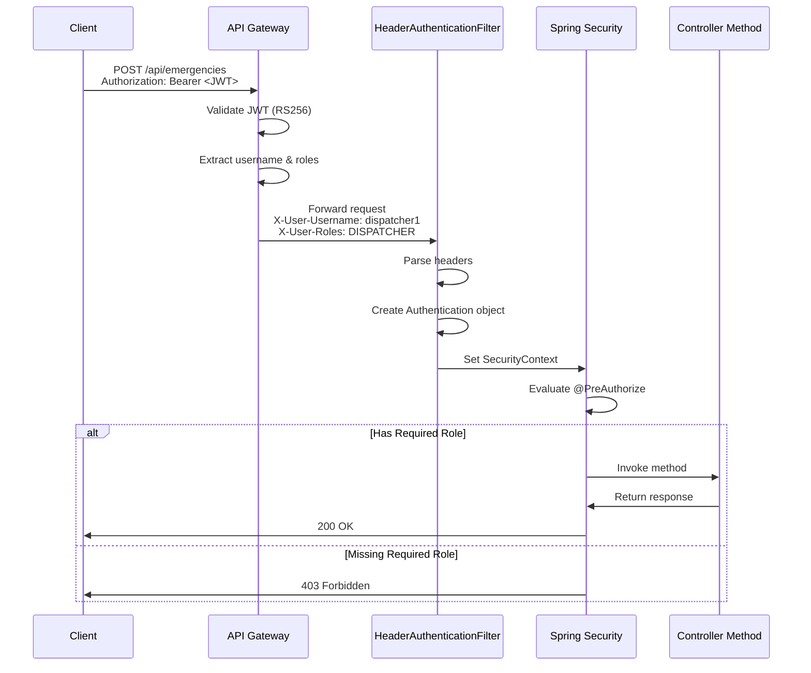

# Service-Level Authorization - Technical Design

## Overview

This design implements role-based access control (RBAC) at the microservice level for the Emergency Dispatch System. The system currently has JWT authentication at the API Gateway, which validates tokens and forwards user context via HTTP headers (`X-User-Username`, `X-User-Roles`). This feature adds authorization enforcement within each microservice to ensure authenticated users can only access endpoints appropriate for their assigned roles.

The authorization system supports three roles:
- **ADMIN**: Full system access including metrics, diagnostics, and all operational endpoints
- **DISPATCHER**: Emergency creation, dispatch operations, and tracking access
- **AMBULANCE_DRIVER**: View assigned emergencies, update ambulance location, and access tracking

The design leverages Spring Security's method-level security with `@PreAuthorize` annotations, providing declarative authorization rules that are easy to understand, test, and maintain. Internal services (Dispatch Service, Notification Service) remain accessible without authorization headers to support service-to-service communication.

## Architecture

### Authorization Flow

```
┌─────────────────────────────────────────────────────────────────────┐
│                          Client Request                              │
│                    Authorization: Bearer <JWT>                       │
└────────────────────────────────┬────────────────────────────────────┘
                                 │
                                 ▼
┌─────────────────────────────────────────────────────────────────────┐
│                        API Gateway (Port 8080)                       │
│  ┌────────────────────────────────────────────────────────────┐    │
│  │           JwtAuthenticationFilter (GlobalFilter)            │    │
│  │  1. Extract Authorization header                            │    │
│  │  2. Validate JWT with public key (RS256)                    │    │
│  │  3. Extract username & roles from token claims              │    │
│  │  4. Add headers: X-User-Username, X-User-Roles              │    │
│  └────────────────────────────────────────────────────────────┘    │
└────────────────────────────────┬────────────────────────────────────┘
                                 │
                                 ▼
┌─────────────────────────────────────────────────────────────────────┐
│                    Microservice (Emergency/Ambulance/Tracking)       │
│  ┌────────────────────────────────────────────────────────────┐    │
│  │              HeaderAuthenticationFilter                     │    │
│  │  1. Extract X-User-Username header                          │    │
│  │  2. Extract X-User-Roles header (comma-separated)           │    │
│  │  3. Parse roles into GrantedAuthority collection            │    │
│  │  4. Create Authentication object                            │    │
│  │  5. Set SecurityContext with Authentication                 │    │
│  └────────────────────────────┬───────────────────────────────┘    │
│                                │                                     │
│                                ▼                                     │
│  ┌────────────────────────────────────────────────────────────┐    │
│  │              Spring Security Filter Chain                   │    │
│  │  - Evaluates @PreAuthorize expressions                      │    │
│  │  - Checks SecurityContext for required roles                │    │
│  │  - Returns 403 if authorization fails                       │    │
│  └────────────────────────────┬───────────────────────────────┘    │
│                                │                                     │
│                                ▼                                     │
│  ┌────────────────────────────────────────────────────────────┐    │
│  │                  Controller Method                          │    │
│  │  @PreAuthorize("hasAnyRole('ADMIN', 'DISPATCHER')")         │    │
│  │  public ResponseEntity<?> createEmergency(...)              │    │
│  └────────────────────────────────────────────────────────────┘    │
└─────────────────────────────────────────────────────────────────────┘
```

### Component Interaction



### Service Authorization Matrix

| Service | Endpoint | ADMIN | DISPATCHER | AMBULANCE_DRIVER |
|---------|----------|-------|------------|------------------|
| **Emergency Service** | | | | |
| | POST /emergency | ✓ | ✓ | ✗ |
| | GET /emergency/{id} | ✓ | ✓ | ✓ |
| | GET /emergency/status/{status} | ✓ | ✓ | ✗ |
| | GET /emergency/pending | ✓ | ✓ | ✗ |
| **Ambulance Service** | | | | |
| | GET /ambulance/available | ✓ | ✓ | ✗ |
| | GET /ambulance/{id} | ✓ | ✓ | ✓ |
| | POST /ambulance/{id}/location | ✓ | ✗ | ✓ |
| | GET /diagnostic/* | ✓ | ✗ | ✗ |
| **Tracking Service** | | | | |
| | GET /api/tracking/ambulance/{id} | ✓ | ✓ | ✓ |
| | WebSocket /ws/tracking | ✓ | ✓ | ✓ |
| **Internal Services** | | | | |
| | Dispatch Service (all) | No authorization required |
| | Notification Service (all) | No authorization required |

## Components and Interfaces

### 1. HeaderAuthenticationFilter

A Spring Security filter that extracts user context from HTTP headers and populates the SecurityContext.

**Responsibilities:**
- Extract `X-User-Username` and `X-User-Roles` headers from incoming requests
- Parse comma-separated role values into Spring Security `GrantedAuthority` objects
- Create an `Authentication` object with username and authorities
- Set the `SecurityContext` with the authentication
- Log warnings when headers are missing on protected endpoints
- Handle invalid or malformed role values gracefully

**Implementation Details:**

```java
@Component
@Order(1)
public class HeaderAuthenticationFilter extends OncePerRequestFilter {
    
    private static final String USERNAME_HEADER = "X-User-Username";
    private static final String ROLES_HEADER = "X-User-Roles";
    private static final String ROLE_PREFIX = "ROLE_";
    
    @Override
    protected void doFilterInternal(
            HttpServletRequest request,
            HttpServletResponse response,
            FilterChain filterChain) throws ServletException, IOException {
        
        String username = request.getHeader(USERNAME_HEADER);
        String rolesHeader = request.getHeader(ROLES_HEADER);
        
        if (username == null) {
            username = "anonymous";
            log.warn("Missing {} header for request: {} {}", 
                USERNAME_HEADER, request.getMethod(), request.getRequestURI());
        }
        
        List<GrantedAuthority> authorities = new ArrayList<>();
        if (rolesHeader != null && !rolesHeader.isBlank()) {
            authorities = Arrays.stream(rolesHeader.split(","))
                .map(String::trim)
                .filter(role -> isValidRole(role))
                .map(role -> new SimpleGrantedAuthority(ROLE_PREFIX + role))
                .collect(Collectors.toList());
        } else {
            log.warn("Missing {} header for request: {} {}", 
                ROLES_HEADER, request.getMethod(), request.getRequestURI());
        }
        
        Authentication authentication = new UsernamePasswordAuthenticationToken(
            username, null, authorities);
        SecurityContextHolder.getContext().setAuthentication(authentication);
        
        try {
            filterChain.doFilter(request, response);
        } finally {
            SecurityContextHolder.clearContext();
        }
    }
    
    private boolean isValidRole(String role) {
        return role.equals("ADMIN") || 
               role.equals("DISPATCHER") || 
               role.equals("AMBULANCE_DRIVER");
    }
}
```

**Configuration:**
- Registered as `@Component` with `@Order(1)` to execute early in filter chain
- Extends `OncePerRequestFilter` to ensure single execution per request
- Clears `SecurityContext` in finally block to prevent context leakage

### 2. SecurityConfiguration

Spring Security configuration class that enables method-level security and configures the filter chain.

**Responsibilities:**
- Enable method-level security with `@EnableMethodSecurity`
- Configure HTTP security to permit all requests (authorization handled by annotations)
- Disable CSRF protection (stateless JWT authentication)
- Register `HeaderAuthenticationFilter` in the security filter chain
- Configure exception handling for authorization failures

**Implementation Details:**

```java
@Configuration
@EnableWebSecurity
@EnableMethodSecurity(prePostEnabled = true)
public class SecurityConfiguration {
    
    private final HeaderAuthenticationFilter headerAuthenticationFilter;
    
    public SecurityConfiguration(HeaderAuthenticationFilter headerAuthenticationFilter) {
        this.headerAuthenticationFilter = headerAuthenticationFilter;
    }
    
    @Bean
    public SecurityFilterChain securityFilterChain(HttpSecurity http) throws Exception {
        http
            .csrf(csrf -> csrf.disable())
            .authorizeHttpRequests(auth -> auth
                .requestMatchers("/actuator/health", "/actuator/info").permitAll()
                .anyRequest().permitAll()
            )
            .addFilterBefore(headerAuthenticationFilter, 
                UsernamePasswordAuthenticationFilter.class)
            .exceptionHandling(ex -> ex
                .accessDeniedHandler(new CustomAccessDeniedHandler())
            );
        
        return http.build();
    }
}
```

**Design Rationale:**
- `permitAll()` on all requests because authorization is enforced at method level via `@PreAuthorize`
- CSRF disabled because JWT tokens are stateless and not vulnerable to CSRF
- Health endpoints remain public for monitoring systems
- Custom access denied handler provides consistent error responses

### 3. CustomAccessDeniedHandler

Handles authorization failures and returns consistent error responses.

**Responsibilities:**
- Intercept `AccessDeniedException` thrown by Spring Security
- Return HTTP 403 Forbidden with descriptive error message
- Log authorization failures with username and requested endpoint
- Avoid disclosing sensitive system information in error messages

**Implementation Details:**

```java
@Slf4j
public class CustomAccessDeniedHandler implements AccessDeniedHandler {
    
    @Override
    public void handle(
            HttpServletRequest request,
            HttpServletResponse response,
            AccessDeniedException accessDeniedException) throws IOException {
        
        Authentication auth = SecurityContextHolder.getContext().getAuthentication();
        String username = auth != null ? auth.getName() : "anonymous";
        
        log.warn("Access denied for user '{}' to {} {}", 
            username, request.getMethod(), request.getRequestURI());
        
        response.setStatus(HttpServletResponse.SC_FORBIDDEN);
        response.setContentType("application/json");
        
        String errorMessage = String.format(
            "{\"error\":\"Access denied\",\"message\":\"User '%s' lacks required role for this operation\",\"status\":403}",
            username
        );
        
        response.getWriter().write(errorMessage);
    }
}
```

### 4. Controller Annotations

Controllers use `@PreAuthorize` annotations to declare authorization rules declaratively.

**Emergency Service Controller:**

```java
@RestController
@RequestMapping("/emergency")
@RequiredArgsConstructor
@Slf4j
public class EmergencyController {
    
    private final EmergencyService emergencyService;
    
    @PostMapping
    @PreAuthorize("hasAnyRole('ADMIN', 'DISPATCHER')")
    public ResponseEntity<Emergency> createEmergency(
            @Valid @RequestBody EmergencyRequest request) {
        // Implementation
    }
    
    @GetMapping("/{emergencyId}")
    @PreAuthorize("hasAnyRole('ADMIN', 'DISPATCHER', 'AMBULANCE_DRIVER')")
    public ResponseEntity<Emergency> getEmergency(
            @PathVariable String emergencyId) {
        // Implementation
    }
    
    @GetMapping("/status/{status}")
    @PreAuthorize("hasAnyRole('ADMIN', 'DISPATCHER')")
    public ResponseEntity<List<Emergency>> getEmergenciesByStatus(
            @PathVariable String status) {
        // Implementation
    }
    
    @GetMapping("/pending")
    @PreAuthorize("hasAnyRole('ADMIN', 'DISPATCHER')")
    public ResponseEntity<List<Emergency>> getPendingEmergencies() {
        // Implementation
    }
}
```

**Ambulance Service Controller:**

```java
@RestController
@RequestMapping("/ambulance")
@RequiredArgsConstructor
@Slf4j
public class AmbulanceController {
    
    private final AmbulanceService ambulanceService;
    
    @GetMapping("/available")
    @PreAuthorize("hasAnyRole('ADMIN', 'DISPATCHER')")
    public ResponseEntity<List<Ambulance>> getAvailableAmbulances() {
        // Implementation
    }
    
    @GetMapping("/{id}")
    @PreAuthorize("hasAnyRole('ADMIN', 'DISPATCHER', 'AMBULANCE_DRIVER')")
    public ResponseEntity<Ambulance> getAmbulance(@PathVariable String id) {
        // Implementation
    }
    
    @PostMapping("/{id}/location")
    @PreAuthorize("hasAnyRole('ADMIN', 'AMBULANCE_DRIVER')")
    public ResponseEntity<String> updateLocation(
            @PathVariable String id,
            @Valid @RequestBody LocationUpdate location) {
        // Implementation
    }
}

@RestController
@RequestMapping("/diagnostic")
@RequiredArgsConstructor
@Slf4j
public class DiagnosticController {
    
    @PostMapping("/init-fleet")
    @PreAuthorize("hasRole('ADMIN')")
    public ResponseEntity<String> initializeFleet() {
        // Implementation
    }
    
    @GetMapping("/fleet-status")
    @PreAuthorize("hasRole('ADMIN')")
    public ResponseEntity<String> getFleetStatus() {
        // Implementation
    }
}
```

**Tracking Service Controller:**

```java
@RestController
@RequestMapping("/api/tracking")
@RequiredArgsConstructor
@Slf4j
public class TrackingController {
    
    private final TrackingCacheService trackingService;
    
    @GetMapping("/ambulance/{ambulanceId}")
    @PreAuthorize("hasAnyRole('ADMIN', 'DISPATCHER', 'AMBULANCE_DRIVER')")
    public ResponseEntity<AmbulanceLocationEvent> getAmbulanceLocation(
            @PathVariable String ambulanceId) {
        // Implementation
    }
    
    @GetMapping("/ambulances")
    @PreAuthorize("hasAnyRole('ADMIN', 'DISPATCHER', 'AMBULANCE_DRIVER')")
    public ResponseEntity<Map<String, AmbulanceLocationEvent>> getAllAmbulances() {
        // Implementation
    }
}
```

### 5. WebSocket Authorization

WebSocket connections require special handling for authorization.

**WebSocket Configuration:**

```java
@Configuration
@EnableWebSocketMessageBroker
public class WebSocketConfig implements WebSocketMessageBrokerConfigurer {
    
    @Override
    public void registerStompEndpoints(StompEndpointRegistry registry) {
        registry.addEndpoint("/ws/tracking")
            .setAllowedOriginPatterns("*")
            .addInterceptors(new WebSocketAuthInterceptor())
            .withSockJS();
    }
    
    @Override
    public void configureMessageBroker(MessageBrokerRegistry config) {
        config.enableSimpleBroker("/topic");
        config.setApplicationDestinationPrefixes("/app");
    }
}
```

**WebSocket Authorization Interceptor:**

```java
@Slf4j
public class WebSocketAuthInterceptor implements HandshakeInterceptor {
    
    private static final String ROLES_HEADER = "X-User-Roles";
    private static final List<String> ALLOWED_ROLES = 
        List.of("ADMIN", "DISPATCHER", "AMBULANCE_DRIVER");
    
    @Override
    public boolean beforeHandshake(
            ServerHttpRequest request,
            ServerHttpResponse response,
            WebSocketHandler wsHandler,
            Map<String, Object> attributes) throws Exception {
        
        if (request instanceof ServletServerHttpRequest servletRequest) {
            HttpServletRequest httpRequest = servletRequest.getServletRequest();
            String rolesHeader = httpRequest.getHeader(ROLES_HEADER);
            
            if (rolesHeader == null || rolesHeader.isBlank()) {
                log.warn("WebSocket connection rejected: Missing {} header", ROLES_HEADER);
                response.setStatusCode(HttpStatus.FORBIDDEN);
                return false;
            }
            
            List<String> roles = Arrays.stream(rolesHeader.split(","))
                .map(String::trim)
                .toList();
            
            boolean hasAllowedRole = roles.stream()
                .anyMatch(ALLOWED_ROLES::contains);
            
            if (!hasAllowedRole) {
                log.warn("WebSocket connection rejected: No valid roles in {}", rolesHeader);
                response.setStatusCode(HttpStatus.FORBIDDEN);
                return false;
            }
            
            attributes.put("roles", roles);
            log.info("WebSocket connection authorized with roles: {}", roles);
        }
        
        return true;
    }
    
    @Override
    public void afterHandshake(
            ServerHttpRequest request,
            ServerHttpResponse response,
            WebSocketHandler wsHandler,
            Exception exception) {
        // No action needed
    }
}
```

## Data Models

### 1. Security Context

Spring Security's `SecurityContext` holds the authentication information for the current request.

**Structure:**
```java
SecurityContext
├── Authentication
    ├── Principal: String (username)
    ├── Credentials: null (not used for header-based auth)
    └── Authorities: Collection<GrantedAuthority>
        └── GrantedAuthority
            └── Authority: String (e.g., "ROLE_ADMIN")
```

**Example:**
```java
Authentication auth = SecurityContextHolder.getContext().getAuthentication();
String username = auth.getName(); // "dispatcher1"
Collection<? extends GrantedAuthority> authorities = auth.getAuthorities();
// [ROLE_DISPATCHER]
```

### 2. Role Representation

Roles are represented as Spring Security `GrantedAuthority` objects with the `ROLE_` prefix.

**Role Mapping:**
- Header value: `ADMIN` → Authority: `ROLE_ADMIN`
- Header value: `DISPATCHER` → Authority: `ROLE_DISPATCHER`
- Header value: `AMBULANCE_DRIVER` → Authority: `ROLE_AMBULANCE_DRIVER`

**SpEL Expressions:**
- `hasRole('ADMIN')` - Checks for `ROLE_ADMIN` authority
- `hasAnyRole('ADMIN', 'DISPATCHER')` - Checks for any of the specified roles
- `hasAuthority('ROLE_ADMIN')` - Explicit authority check (includes prefix)

### 3. Authorization Error Response

**Error Response Model:**
```json
{
  "error": "Access denied",
  "message": "User 'dispatcher1' lacks required role for this operation",
  "status": 403
}
```

**Fields:**
- `error`: Brief error type ("Access denied")
- `message`: Descriptive message including username (no sensitive data)
- `status`: HTTP status code (403)

## API Specifications

### Emergency Service Endpoints

#### POST /emergency
**Authorization:** `ADMIN`, `DISPATCHER`

**Request:**
```http
POST /emergency HTTP/1.1
Host: localhost:8081
X-User-Username: dispatcher1
X-User-Roles: DISPATCHER
Content-Type: application/json

{
  "latitude": 18.5204,
  "longitude": 73.8567,
  "severity": "HIGH",
  "description": "Cardiac arrest"
}
```

**Success Response (201):**
```json
{
  "emergencyId": "EMG-123456",
  "latitude": 18.5204,
  "longitude": 73.8567,
  "severity": "HIGH",
  "status": "PENDING",
  "createdAt": "2024-01-15T10:30:00Z"
}
```

**Authorization Failure (403):**
```json
{
  "error": "Access denied",
  "message": "User 'driver1' lacks required role for this operation",
  "status": 403
}
```

#### GET /emergency/{emergencyId}
**Authorization:** `ADMIN`, `DISPATCHER`, `AMBULANCE_DRIVER`

**Request:**
```http
GET /emergency/EMG-123456 HTTP/1.1
Host: localhost:8081
X-User-Username: driver1
X-User-Roles: AMBULANCE_DRIVER
```

**Success Response (200):**
```json
{
  "emergencyId": "EMG-123456",
  "latitude": 18.5204,
  "longitude": 73.8567,
  "severity": "HIGH",
  "status": "ASSIGNED",
  "assignedAmbulanceId": "AMB-001"
}
```

#### GET /emergency/status/{status}
**Authorization:** `ADMIN`, `DISPATCHER`

**Request:**
```http
GET /emergency/status/PENDING HTTP/1.1
Host: localhost:8081
X-User-Username: dispatcher1
X-User-Roles: DISPATCHER
```

**Success Response (200):**
```json
[
  {
    "emergencyId": "EMG-123456",
    "status": "PENDING",
    "severity": "HIGH"
  },
  {
    "emergencyId": "EMG-123457",
    "status": "PENDING",
    "severity": "MEDIUM"
  }
]
```

#### GET /emergency/pending
**Authorization:** `ADMIN`, `DISPATCHER`

**Request:**
```http
GET /emergency/pending HTTP/1.1
Host: localhost:8081
X-User-Username: admin1
X-User-Roles: ADMIN
```

**Success Response (200):**
```json
[
  {
    "emergencyId": "EMG-123456",
    "status": "PENDING",
    "severity": "HIGH",
    "createdAt": "2024-01-15T10:30:00Z"
  }
]
```

### Ambulance Service Endpoints

#### GET /ambulance/available
**Authorization:** `ADMIN`, `DISPATCHER`

**Request:**
```http
GET /ambulance/available HTTP/1.1
Host: localhost:8082
X-User-Username: dispatcher1
X-User-Roles: DISPATCHER
```

**Success Response (200):**
```json
[
  {
    "ambulanceId": "AMB-001",
    "status": "AVAILABLE",
    "latitude": 18.5196,
    "longitude": 73.8553
  }
]
```

#### GET /ambulance/{id}
**Authorization:** `ADMIN`, `DISPATCHER`, `AMBULANCE_DRIVER`

**Request:**
```http
GET /ambulance/AMB-001 HTTP/1.1
Host: localhost:8082
X-User-Username: driver1
X-User-Roles: AMBULANCE_DRIVER
```

**Success Response (200):**
```json
{
  "ambulanceId": "AMB-001",
  "status": "ASSIGNED",
  "latitude": 18.5196,
  "longitude": 73.8553,
  "assignedEmergencyId": "EMG-123456"
}
```

#### POST /ambulance/{id}/location
**Authorization:** `ADMIN`, `AMBULANCE_DRIVER`

**Request:**
```http
POST /ambulance/AMB-001/location HTTP/1.1
Host: localhost:8082
X-User-Username: driver1
X-User-Roles: AMBULANCE_DRIVER
Content-Type: application/json

{
  "latitude": 18.5200,
  "longitude": 73.8560,
  "speed": 45.5,
  "heading": 90.0
}
```

**Success Response (200):**
```json
{
  "message": "Location updated successfully",
  "ambulanceId": "AMB-001"
}
```

#### GET /diagnostic/fleet-status
**Authorization:** `ADMIN` only

**Request:**
```http
GET /diagnostic/fleet-status HTTP/1.1
Host: localhost:8082
X-User-Username: admin1
X-User-Roles: ADMIN
```

**Success Response (200):**
```json
{
  "totalAmbulances": 10,
  "available": 5,
  "assigned": 3,
  "enRoute": 2
}
```

### Tracking Service Endpoints

#### GET /api/tracking/ambulance/{ambulanceId}
**Authorization:** `ADMIN`, `DISPATCHER`, `AMBULANCE_DRIVER`

**Request:**
```http
GET /api/tracking/ambulance/AMB-001 HTTP/1.1
Host: localhost:8085
X-User-Username: dispatcher1
X-User-Roles: DISPATCHER
```

**Success Response (200):**
```json
{
  "ambulanceId": "AMB-001",
  "latitude": 18.5200,
  "longitude": 73.8560,
  "speed": 45.5,
  "heading": 90.0,
  "timestamp": 1705315800000
}
```

#### WebSocket /ws/tracking
**Authorization:** `ADMIN`, `DISPATCHER`, `AMBULANCE_DRIVER`

**Connection:**
```javascript
const socket = new SockJS('http://localhost:8085/ws/tracking', null, {
  headers: {
    'X-User-Roles': 'DISPATCHER'
  }
});
const stompClient = Stomp.over(socket);
```

**Subscribe:**
```javascript
stompClient.subscribe('/topic/ambulance-locations', (message) => {
  const location = JSON.parse(message.body);
  console.log('Ambulance location:', location);
});
```

**Message Format:**
```json
{
  "ambulanceId": "AMB-001",
  "latitude": 18.5200,
  "longitude": 73.8560,
  "speed": 45.5,
  "heading": 90.0,
  "timestamp": 1705315800000
}
```

## Security Considerations

### 1. Header Trust Model

**Assumption:** The API Gateway is the only entry point to microservices, and it validates JWT tokens before forwarding requests.

**Implications:**
- Microservices trust headers forwarded by the gateway
- Network-level security (VPC, service mesh) prevents direct access to microservices
- Internal services (Dispatch, Notification) remain accessible without headers for service-to-service calls

**Mitigation:**
- Deploy microservices in private network segments
- Use network policies to restrict access to gateway only
- Consider mutual TLS (mTLS) for service-to-service authentication in production

### 2. Role Validation

**Valid Roles:** Only `ADMIN`, `DISPATCHER`, and `AMBULANCE_DRIVER` are recognized.

**Invalid Role Handling:**
- Invalid role names in `X-User-Roles` header are silently ignored
- If all roles are invalid, the security context has no authorities
- Protected endpoints return 403 Forbidden

**Rationale:** Fail-safe approach prevents unauthorized access when roles are misconfigured.

### 3. Missing Headers

**Behavior:**
- Missing `X-User-Username`: Defaults to "anonymous"
- Missing `X-User-Roles`: Empty authority collection
- Protected endpoints: Return 403 Forbidden
- Warning logged for debugging

**Rationale:** Graceful degradation allows health checks and public endpoints to function while protecting sensitive operations.

### 4. Authorization vs Authentication

**Authentication:** Handled by API Gateway (JWT validation)
**Authorization:** Handled by microservices (role-based access control)

**Separation of Concerns:**
- Gateway: "Who are you?" (validates identity)
- Microservice: "What can you do?" (enforces permissions)

### 5. Logging and Auditing

**Logged Events:**
- Authorization failures (username, endpoint, timestamp)
- Missing or invalid headers
- WebSocket connection attempts

**Log Level:**
- WARN: Missing headers, authorization failures
- INFO: Successful WebSocket connections
- DEBUG: Header extraction details

**Security:**
- Do not log sensitive data (passwords, tokens)
- Do not log full request bodies
- Include correlation IDs for request tracing

### 6. Error Message Security

**Principles:**
- Provide enough information for debugging
- Do not disclose system internals
- Do not reveal other users' information
- Consistent error format

**Example Safe Message:**
```json
{
  "error": "Access denied",
  "message": "User 'dispatcher1' lacks required role for this operation",
  "status": 403
}
```

**Avoid:**
- "User dispatcher1 needs ADMIN role but has DISPATCHER"
- "Authorization failed: hasRole('ADMIN') returned false"
- Stack traces in production responses

### 7. Internal Service Exemption

**Services Without Authorization:**
- Dispatch Service (port 8083)
- Notification Service (port 8084)

**Rationale:**
- These services are called by other microservices, not external clients
- API Gateway does not expose these services
- Simplifies service-to-service communication

**Security:**
- Network isolation prevents external access
- Consider service mesh for mTLS in production
- Monitor internal service calls for anomalies

### 8. Production Hardening

**Recommendations:**
- Enable HTTPS/TLS for all communication
- Implement rate limiting at gateway
- Add request correlation IDs for tracing
- Set up security monitoring and alerting
- Regular security audits of authorization rules
- Principle of least privilege: grant minimum required roles
- Periodic role review and cleanup


## Correctness Properties

A property is a characteristic or behavior that should hold true across all valid executions of a system—essentially, a formal statement about what the system should do. Properties serve as the bridge between human-readable specifications and machine-verifiable correctness guarantees.

### Property Reflection

After analyzing all acceptance criteria, I identified several areas where properties could be redundant:

1. **Authorization Matrix Properties**: Requirements 2.1-2.12, 3.1-3.12, and 4.1-4.7 all specify individual endpoint/role combinations. Rather than creating separate properties for each combination, these can be consolidated into comprehensive authorization matrix properties for each service.

2. **Authorization Failure Behavior**: Requirements 5.5, 6.2, 7.1, 7.2, 7.3, and 7.5 all describe different aspects of what happens when authorization fails. These can be combined into a single comprehensive property about authorization failure behavior.

3. **Authorization Success Behavior**: Requirements 5.6 and the positive cases in 2.x, 3.x, 4.x all describe successful authorization. These can be consolidated into properties that verify the authorization matrix allows correct access.

4. **Header Parsing**: Requirements 1.1, 1.2, and 1.3 describe the parsing and SecurityContext creation process. These are sequential steps that can be combined into a round-trip property.

5. **Internal Service Access**: Requirements 10.1, 10.2, and 10.3 all state that internal services should work without authorization. These can be combined into a single property.

### Property 1: Header to SecurityContext Round Trip

For any valid username and comma-separated role string, when the Authorization_Filter processes a request with X-User-Username and X-User-Roles headers, the resulting SecurityContext should contain an Authentication object with the same username and the parsed roles as GrantedAuthority objects with ROLE_ prefix.

**Validates: Requirements 1.1, 1.2, 1.3**

### Property 2: Invalid Roles Filtered

For any X-User-Roles header containing a mix of valid roles (ADMIN, DISPATCHER, AMBULANCE_DRIVER) and invalid role names, the Authorization_Filter should include only the valid roles in the SecurityContext and ignore invalid ones.

**Validates: Requirements 6.3**

### Property 3: Emergency Service Authorization Matrix

For any endpoint in Emergency Service and any role, the authorization outcome should match the defined matrix:
- POST /emergency: Allow ADMIN, DISPATCHER; Deny AMBULANCE_DRIVER
- GET /emergency/{id}: Allow ADMIN, DISPATCHER, AMBULANCE_DRIVER
- GET /emergency/status/{status}: Allow ADMIN, DISPATCHER; Deny AMBULANCE_DRIVER
- GET /emergency/pending: Allow ADMIN, DISPATCHER; Deny AMBULANCE_DRIVER

**Validates: Requirements 2.1, 2.2, 2.3, 2.4, 2.5, 2.6, 2.7, 2.8, 2.9, 2.10, 2.11, 2.12**

### Property 4: Ambulance Service Authorization Matrix

For any endpoint in Ambulance Service and any role, the authorization outcome should match the defined matrix:
- GET /ambulance/available: Allow ADMIN, DISPATCHER; Deny AMBULANCE_DRIVER
- GET /ambulance/{id}: Allow ADMIN, DISPATCHER, AMBULANCE_DRIVER
- POST /ambulance/{id}/location: Allow ADMIN, AMBULANCE_DRIVER; Deny DISPATCHER
- GET /diagnostic/*: Allow ADMIN only; Deny DISPATCHER, AMBULANCE_DRIVER

**Validates: Requirements 3.1, 3.2, 3.3, 3.4, 3.5, 3.6, 3.7, 3.8, 3.9, 3.10, 3.11, 3.12**

### Property 5: Tracking Service Authorization Matrix

For any endpoint in Tracking Service and any role, the authorization outcome should match the defined matrix:
- GET /api/tracking/ambulance/{id}: Allow ADMIN, DISPATCHER, AMBULANCE_DRIVER
- WebSocket /ws/tracking: Allow ADMIN, DISPATCHER, AMBULANCE_DRIVER; Deny users without these roles

**Validates: Requirements 4.1, 4.2, 4.3, 4.4, 4.5, 4.6, 4.7**

### Property 6: Authorization Check Precedes Method Execution

For any protected endpoint with @PreAuthorize annotation, when authorization fails, the controller method should not execute and the response should be HTTP 403 Forbidden.

**Validates: Requirements 5.4, 5.5**

### Property 7: Successful Authorization Executes Method

For any protected endpoint with @PreAuthorize annotation, when authorization succeeds (user has required role), the controller method should execute and return its normal response (not 403).

**Validates: Requirements 5.6**

### Property 8: Missing Roles Header Results in Empty Authorities

For any request missing the X-User-Roles header, the Authorization_Filter should create a SecurityContext with an empty authorities collection, and any protected endpoint should return HTTP 403 Forbidden.

**Validates: Requirements 1.4, 6.1, 6.2**

### Property 9: Authorization Failure Response Format

For any protected endpoint where authorization fails, the response should have HTTP status 403, include a JSON body with "error", "message", and "status" fields, and the message should indicate the user lacks the required role.

**Validates: Requirements 7.1, 7.2, 7.3**

### Property 10: Authorization Failures Are Logged

For any protected endpoint where authorization fails, a warning log entry should be created containing the username and the requested endpoint path.

**Validates: Requirements 7.5**

### Property 11: Internal Services Require No Authorization

For any endpoint in Dispatch_Service or Notification_Service, requests should be processed successfully regardless of whether X-User-Roles header is present or what roles it contains.

**Validates: Requirements 10.1, 10.2, 10.3**

### Property 12: ADMIN Role Has Universal Access

For any protected endpoint across all services (Emergency, Ambulance, Tracking), a user with ADMIN role should be able to access the endpoint successfully.

**Validates: Requirements 2.1, 2.6, 2.7, 2.8, 3.2, 3.6, 3.8, 3.10, 4.3, 4.6**

## Error Handling

### 1. Authorization Failures

**Scenario:** User lacks required role for endpoint

**Handling:**
- Spring Security intercepts before method execution
- `CustomAccessDeniedHandler` catches `AccessDeniedException`
- Returns HTTP 403 with JSON error response
- Logs warning with username and endpoint

**Example:**
```java
@Slf4j
public class CustomAccessDeniedHandler implements AccessDeniedHandler {
    @Override
    public void handle(HttpServletRequest request, HttpServletResponse response,
                      AccessDeniedException ex) throws IOException {
        Authentication auth = SecurityContextHolder.getContext().getAuthentication();
        String username = auth != null ? auth.getName() : "anonymous";
        
        log.warn("Access denied for user '{}' to {} {}", 
            username, request.getMethod(), request.getRequestURI());
        
        response.setStatus(HttpServletResponse.SC_FORBIDDEN);
        response.setContentType("application/json");
        response.getWriter().write(String.format(
            "{\"error\":\"Access denied\",\"message\":\"User '%s' lacks required role for this operation\",\"status\":403}",
            username
        ));
    }
}
```

### 2. Missing Headers

**Scenario:** Request missing X-User-Username or X-User-Roles headers

**Handling:**
- `HeaderAuthenticationFilter` detects missing headers
- Logs warning message
- Creates SecurityContext with default values:
  - Missing username → "anonymous"
  - Missing roles → empty authorities collection
- Protected endpoints return 403 due to missing authorities

**Rationale:** Fail-safe approach prevents unauthorized access while allowing health checks to function.

### 3. Invalid Role Names

**Scenario:** X-User-Roles header contains unrecognized role names

**Handling:**
- `HeaderAuthenticationFilter` validates each role
- Invalid roles are silently filtered out
- Only valid roles (ADMIN, DISPATCHER, AMBULANCE_DRIVER) are added to SecurityContext
- If all roles are invalid, empty authorities collection results in 403 for protected endpoints

**Example:**
```java
private boolean isValidRole(String role) {
    return role.equals("ADMIN") || 
           role.equals("DISPATCHER") || 
           role.equals("AMBULANCE_DRIVER");
}
```

### 4. WebSocket Authorization Failures

**Scenario:** WebSocket connection attempt without valid roles

**Handling:**
- `WebSocketAuthInterceptor` checks X-User-Roles header in handshake
- If header missing or contains no valid roles, handshake is rejected
- Returns HTTP 403 Forbidden
- Logs warning with connection details

**Example:**
```java
@Override
public boolean beforeHandshake(ServerHttpRequest request, ServerHttpResponse response,
                               WebSocketHandler wsHandler, Map<String, Object> attributes) {
    String rolesHeader = httpRequest.getHeader(ROLES_HEADER);
    
    if (rolesHeader == null || rolesHeader.isBlank()) {
        log.warn("WebSocket connection rejected: Missing {} header", ROLES_HEADER);
        response.setStatusCode(HttpStatus.FORBIDDEN);
        return false;
    }
    
    // Validate roles...
    return hasAllowedRole;
}
```

### 5. SecurityContext Leakage Prevention

**Scenario:** SecurityContext persists across requests in thread pool

**Handling:**
- `HeaderAuthenticationFilter` clears SecurityContext in finally block
- Ensures no context leakage between requests
- Each request gets fresh SecurityContext

**Example:**
```java
try {
    filterChain.doFilter(request, response);
} finally {
    SecurityContextHolder.clearContext();
}
```

### 6. Exception Handling in Controllers

**Scenario:** Business logic exceptions in controller methods

**Handling:**
- Authorization happens before method execution
- If authorization succeeds but method throws exception, standard Spring error handling applies
- Authorization errors (403) are distinct from business logic errors (400, 404, 500)

**Best Practice:**
```java
@RestControllerAdvice
public class GlobalExceptionHandler {
    
    @ExceptionHandler(AccessDeniedException.class)
    public ResponseEntity<ErrorResponse> handleAccessDenied(AccessDeniedException ex) {
        // Handled by CustomAccessDeniedHandler
        return ResponseEntity.status(403).body(new ErrorResponse("Access denied"));
    }
    
    @ExceptionHandler(Exception.class)
    public ResponseEntity<ErrorResponse> handleGeneral(Exception ex) {
        log.error("Unexpected error", ex);
        return ResponseEntity.status(500).body(new ErrorResponse("Internal server error"));
    }
}
```

## Testing Strategy

### Overview

The testing strategy employs a dual approach combining unit tests for specific scenarios and property-based tests for comprehensive coverage of authorization rules. This ensures both concrete examples work correctly and universal properties hold across all inputs.

### Unit Testing

Unit tests focus on specific examples, edge cases, and integration points.

**Test Categories:**

1. **Filter Tests** - Verify HeaderAuthenticationFilter behavior
   - Test with valid headers
   - Test with missing username header (defaults to "anonymous")
   - Test with missing roles header (empty authorities)
   - Test with invalid role names (filtered out)
   - Test SecurityContext population
   - Test SecurityContext cleanup in finally block

2. **Configuration Tests** - Verify Spring Security setup
   - Test @EnableMethodSecurity is present
   - Test filter is registered in security chain
   - Test CustomAccessDeniedHandler is configured

3. **Controller Integration Tests** - Verify specific endpoint examples
   - Test DISPATCHER can POST /emergency
   - Test ADMIN can access /diagnostic endpoints
   - Test AMBULANCE_DRIVER cannot POST /emergency
   - Test WebSocket connection with valid roles
   - Test WebSocket rejection with invalid roles

4. **Error Handling Tests** - Verify error responses
   - Test 403 response format
   - Test error message content
   - Test logging of authorization failures

**Example Unit Test:**

```java
@WebMvcTest(EmergencyController.class)
@Import(SecurityConfiguration.class)
class EmergencyControllerAuthTest {
    
    @Autowired
    private MockMvc mockMvc;
    
    @Test
    void dispatcherCanCreateEmergency() throws Exception {
        mockMvc.perform(post("/emergency")
                .header("X-User-Username", "dispatcher1")
                .header("X-User-Roles", "DISPATCHER")
                .contentType(MediaType.APPLICATION_JSON)
                .content("{\"latitude\":18.5204,\"longitude\":73.8567}"))
            .andExpect(status().isCreated());
    }
    
    @Test
    void ambulanceDriverCannotCreateEmergency() throws Exception {
        mockMvc.perform(post("/emergency")
                .header("X-User-Username", "driver1")
                .header("X-User-Roles", "AMBULANCE_DRIVER")
                .contentType(MediaType.APPLICATION_JSON)
                .content("{\"latitude\":18.5204,\"longitude\":73.8567}"))
            .andExpect(status().isForbidden())
            .andExpect(jsonPath("$.error").value("Access denied"));
    }
    
    @Test
    void missingRolesHeaderResultsInForbidden() throws Exception {
        mockMvc.perform(post("/emergency")
                .header("X-User-Username", "user1")
                .contentType(MediaType.APPLICATION_JSON)
                .content("{\"latitude\":18.5204,\"longitude\":73.8567}"))
            .andExpect(status().isForbidden());
    }
}
```

### Property-Based Testing

Property-based tests verify universal properties across many generated inputs, providing comprehensive coverage of the authorization matrix.

**Property Testing Library:** Use **jqwik** for Java property-based testing (https://jqwik.net/)

**Configuration:**
- Minimum 100 iterations per property test
- Each test tagged with feature name and property number
- Use custom generators for roles, endpoints, and headers

**Property Test Examples:**

```java
@PropertyTest
@Tag("Feature: service-level-authorization, Property 1: Header to SecurityContext Round Trip")
void headerToSecurityContextRoundTrip(
        @ForAll @AlphaChars @StringLength(min = 3, max = 20) String username,
        @ForAll("validRoles") List<String> roles) {
    
    String rolesHeader = String.join(",", roles);
    MockHttpServletRequest request = new MockHttpServletRequest();
    request.addHeader("X-User-Username", username);
    request.addHeader("X-User-Roles", rolesHeader);
    
    // Process through filter
    filter.doFilterInternal(request, response, filterChain);
    
    // Verify SecurityContext
    Authentication auth = SecurityContextHolder.getContext().getAuthentication();
    assertThat(auth.getName()).isEqualTo(username);
    
    Set<String> expectedAuthorities = roles.stream()
        .map(role -> "ROLE_" + role)
        .collect(Collectors.toSet());
    Set<String> actualAuthorities = auth.getAuthorities().stream()
        .map(GrantedAuthority::getAuthority)
        .collect(Collectors.toSet());
    
    assertThat(actualAuthorities).isEqualTo(expectedAuthorities);
}

@Provide
Arbitrary<List<String>> validRoles() {
    return Arbitraries.of("ADMIN", "DISPATCHER", "AMBULANCE_DRIVER")
        .list().ofMinSize(1).ofMaxSize(3);
}

@PropertyTest
@Tag("Feature: service-level-authorization, Property 2: Invalid Roles Filtered")
void invalidRolesFiltered(
        @ForAll("validRoles") List<String> validRoles,
        @ForAll @AlphaChars @StringLength(min = 3, max = 15) List<String> invalidRoles) {
    
    List<String> allRoles = new ArrayList<>();
    allRoles.addAll(validRoles);
    allRoles.addAll(invalidRoles);
    Collections.shuffle(allRoles);
    
    String rolesHeader = String.join(",", allRoles);
    MockHttpServletRequest request = new MockHttpServletRequest();
    request.addHeader("X-User-Username", "testuser");
    request.addHeader("X-User-Roles", rolesHeader);
    
    filter.doFilterInternal(request, response, filterChain);
    
    Authentication auth = SecurityContextHolder.getContext().getAuthentication();
    Set<String> actualRoles = auth.getAuthorities().stream()
        .map(GrantedAuthority::getAuthority)
        .map(a -> a.replace("ROLE_", ""))
        .collect(Collectors.toSet());
    
    // Only valid roles should be present
    assertThat(actualRoles).containsExactlyInAnyOrderElementsOf(validRoles);
    assertThat(actualRoles).doesNotContainAnyElementsOf(invalidRoles);
}

@PropertyTest
@Tag("Feature: service-level-authorization, Property 3: Emergency Service Authorization Matrix")
void emergencyServiceAuthorizationMatrix(
        @ForAll("emergencyEndpoints") EndpointSpec endpoint,
        @ForAll("allRoles") String role) {
    
    MockHttpServletRequest request = new MockHttpServletRequest();
    request.setMethod(endpoint.method());
    request.setRequestURI(endpoint.path());
    request.addHeader("X-User-Username", "testuser");
    request.addHeader("X-User-Roles", role);
    
    ResultActions result = mockMvc.perform(
        request(endpoint.method(), endpoint.path())
            .header("X-User-Username", "testuser")
            .header("X-User-Roles", role)
    );
    
    boolean shouldAllow = endpoint.allowedRoles().contains(role);
    
    if (shouldAllow) {
        result.andExpect(status().isNot(403));
    } else {
        result.andExpect(status().isForbidden());
    }
}

@Provide
Arbitrary<EndpointSpec> emergencyEndpoints() {
    return Arbitraries.of(
        new EndpointSpec("POST", "/emergency", Set.of("ADMIN", "DISPATCHER")),
        new EndpointSpec("GET", "/emergency/EMG-123", Set.of("ADMIN", "DISPATCHER", "AMBULANCE_DRIVER")),
        new EndpointSpec("GET", "/emergency/status/PENDING", Set.of("ADMIN", "DISPATCHER")),
        new EndpointSpec("GET", "/emergency/pending", Set.of("ADMIN", "DISPATCHER"))
    );
}

@Provide
Arbitrary<String> allRoles() {
    return Arbitraries.of("ADMIN", "DISPATCHER", "AMBULANCE_DRIVER");
}

@PropertyTest
@Tag("Feature: service-level-authorization, Property 9: Authorization Failure Response Format")
void authorizationFailureResponseFormat(
        @ForAll("protectedEndpoints") EndpointSpec endpoint,
        @ForAll @AlphaChars @StringLength(min = 3, max = 20) String username) {
    
    // Use a role that's not allowed for this endpoint
    String unauthorizedRole = endpoint.allowedRoles().contains("ADMIN") 
        ? "INVALID_ROLE" : "ADMIN";
    
    MockHttpServletRequest request = new MockHttpServletRequest();
    request.addHeader("X-User-Username", username);
    request.addHeader("X-User-Roles", unauthorizedRole);
    
    ResultActions result = mockMvc.perform(
        request(endpoint.method(), endpoint.path())
            .header("X-User-Username", username)
            .header("X-User-Roles", unauthorizedRole)
    );
    
    result.andExpect(status().isForbidden())
        .andExpect(jsonPath("$.error").exists())
        .andExpect(jsonPath("$.message").exists())
        .andExpect(jsonPath("$.status").value(403))
        .andExpect(jsonPath("$.message").value(containsString(username)))
        .andExpect(jsonPath("$.message").value(containsString("lacks required role")));
}

@PropertyTest
@Tag("Feature: service-level-authorization, Property 11: Internal Services Require No Authorization")
void internalServicesRequireNoAuthorization(
        @ForAll("internalEndpoints") String endpoint,
        @ForAll("optionalRoles") Optional<String> roles) {
    
    MockHttpServletRequest request = new MockHttpServletRequest();
    request.setRequestURI(endpoint);
    
    // Randomly include or exclude roles header
    roles.ifPresent(r -> request.addHeader("X-User-Roles", r));
    
    // Internal services should always process the request
    // (This would be tested against actual Dispatch/Notification services)
    ResultActions result = mockMvc.perform(get(endpoint));
    
    // Should not return 403 regardless of headers
    result.andExpect(status().isNot(403));
}

@Provide
Arbitrary<String> internalEndpoints() {
    return Arbitraries.of(
        "/dispatch/assign",
        "/notification/send"
    );
}

@Provide
Arbitrary<Optional<String>> optionalRoles() {
    return Arbitraries.of("ADMIN", "DISPATCHER", "AMBULANCE_DRIVER", "INVALID")
        .optional();
}

record EndpointSpec(String method, String path, Set<String> allowedRoles) {}
```

### Integration Testing

Integration tests verify the complete authorization flow from API Gateway through microservices.

**Test Scenarios:**

1. **End-to-End Authorization Flow**
   - Start API Gateway and microservices
   - Obtain JWT token from auth service
   - Make request through gateway
   - Verify headers are forwarded
   - Verify authorization is enforced

2. **Service-to-Service Communication**
   - Verify internal services (Dispatch, Notification) work without headers
   - Verify external services require headers

3. **WebSocket Authorization**
   - Test WebSocket connection through gateway
   - Verify headers are included in handshake
   - Verify authorization is enforced

**Example Integration Test:**

```java
@SpringBootTest(webEnvironment = WebEnvironment.RANDOM_PORT)
@TestPropertySource(properties = {
    "spring.kafka.bootstrap-servers=${spring.embedded.kafka.brokers}"
})
class AuthorizationIntegrationTest {
    
    @LocalServerPort
    private int port;
    
    @Autowired
    private TestRestTemplate restTemplate;
    
    @Test
    void endToEndAuthorizationFlow() {
        // Simulate gateway forwarding headers
        HttpHeaders headers = new HttpHeaders();
        headers.set("X-User-Username", "dispatcher1");
        headers.set("X-User-Roles", "DISPATCHER");
        
        HttpEntity<EmergencyRequest> request = new HttpEntity<>(
            new EmergencyRequest(18.5204, 73.8567, "HIGH"),
            headers
        );
        
        ResponseEntity<Emergency> response = restTemplate.exchange(
            "http://localhost:" + port + "/emergency",
            HttpMethod.POST,
            request,
            Emergency.class
        );
        
        assertThat(response.getStatusCode()).isEqualTo(HttpStatus.CREATED);
    }
    
    @Test
    void unauthorizedRoleReturns403() {
        HttpHeaders headers = new HttpHeaders();
        headers.set("X-User-Username", "driver1");
        headers.set("X-User-Roles", "AMBULANCE_DRIVER");
        
        HttpEntity<EmergencyRequest> request = new HttpEntity<>(
            new EmergencyRequest(18.5204, 73.8567, "HIGH"),
            headers
        );
        
        ResponseEntity<String> response = restTemplate.exchange(
            "http://localhost:" + port + "/emergency",
            HttpMethod.POST,
            request,
            String.class
        );
        
        assertThat(response.getStatusCode()).isEqualTo(HttpStatus.FORBIDDEN);
    }
}
```

### Test Coverage Goals

- **Line Coverage:** Minimum 80% for security-related code
- **Branch Coverage:** Minimum 90% for authorization logic
- **Property Tests:** All 12 correctness properties implemented
- **Unit Tests:** All edge cases and examples covered
- **Integration Tests:** End-to-end flows verified

### Continuous Testing

- Run unit tests on every commit
- Run property tests (100 iterations) on every pull request
- Run integration tests nightly
- Monitor test execution time (property tests may be slower)
- Fail build on any authorization test failure

### Manual Testing

**Test Checklist:**

1. Test each role against each endpoint using curl
2. Test with missing headers
3. Test with invalid role names
4. Test WebSocket connections
5. Verify error messages don't leak sensitive data
6. Verify logs contain authorization failures
7. Test internal services work without headers

**Example Manual Test:**

```bash
# Test DISPATCHER can create emergency
curl -X POST http://localhost:8081/emergency \
  -H "X-User-Username: dispatcher1" \
  -H "X-User-Roles: DISPATCHER" \
  -H "Content-Type: application/json" \
  -d '{"latitude":18.5204,"longitude":73.8567,"severity":"HIGH"}'

# Test AMBULANCE_DRIVER cannot create emergency (should return 403)
curl -X POST http://localhost:8081/emergency \
  -H "X-User-Username: driver1" \
  -H "X-User-Roles: AMBULANCE_DRIVER" \
  -H "Content-Type: application/json" \
  -d '{"latitude":18.5204,"longitude":73.8567,"severity":"HIGH"}'

# Test missing roles header (should return 403)
curl -X POST http://localhost:8081/emergency \
  -H "X-User-Username: user1" \
  -H "Content-Type: application/json" \
  -d '{"latitude":18.5204,"longitude":73.8567,"severity":"HIGH"}'
```

## Implementation Dependencies

### Maven Dependencies

Add to each service's `pom.xml` (Emergency, Ambulance, Tracking):

```xml
<!-- Spring Security -->
<dependency>
    <groupId>org.springframework.boot</groupId>
    <artifactId>spring-boot-starter-security</artifactId>
</dependency>

<!-- Test Dependencies -->
<dependency>
    <groupId>org.springframework.security</groupId>
    <artifactId>spring-security-test</artifactId>
    <scope>test</scope>
</dependency>

<!-- Property-Based Testing -->
<dependency>
    <groupId>net.jqwik</groupId>
    <artifactId>jqwik</artifactId>
    <version>1.8.2</version>
    <scope>test</scope>
</dependency>
```

### Configuration Files

No additional configuration files needed. All configuration is done via Java annotations and code.

### Environment Variables

No new environment variables required. The system uses existing HTTP headers forwarded by the API Gateway.

## Deployment Considerations

### 1. Rollout Strategy

**Phase 1: Deploy with Logging Only**
- Deploy HeaderAuthenticationFilter with logging enabled
- Do not enforce authorization yet
- Monitor logs to verify headers are being forwarded correctly
- Identify any missing or malformed headers

**Phase 2: Enable Authorization in Non-Production**
- Enable @PreAuthorize annotations in staging environment
- Run comprehensive test suite
- Verify all authorization rules work correctly
- Test with real JWT tokens from auth service

**Phase 3: Production Deployment**
- Deploy to production with authorization enabled
- Monitor error rates and 403 responses
- Have rollback plan ready
- Gradually enable for percentage of traffic (canary deployment)

### 2. Monitoring

**Metrics to Track:**
- Authorization failure rate (403 responses)
- Missing header rate
- Invalid role rate
- Response time impact of authorization checks
- WebSocket connection success/failure rate

**Alerts:**
- Spike in 403 responses (may indicate misconfiguration)
- High rate of missing headers (gateway issue)
- Authorization filter exceptions

### 3. Backward Compatibility

**Considerations:**
- Internal services (Dispatch, Notification) remain unchanged
- API Gateway already forwards headers (no changes needed)
- Clients continue using JWT tokens (no changes needed)
- Only microservices add authorization enforcement

**Migration Path:**
- Services can be updated independently
- No breaking changes to APIs
- Existing clients continue to work

### 4. Performance Impact

**Expected Impact:**
- Header parsing: < 1ms per request
- SecurityContext creation: < 1ms per request
- @PreAuthorize evaluation: < 1ms per request
- Total overhead: < 3ms per request

**Optimization:**
- Filter runs once per request (OncePerRequestFilter)
- No database calls for authorization
- No network calls for authorization
- Stateless evaluation using SecurityContext

### 5. Security Hardening

**Production Checklist:**
- [ ] Deploy services in private network (no direct external access)
- [ ] Configure network policies to allow only gateway traffic
- [ ] Enable HTTPS/TLS for all communication
- [ ] Set up security monitoring and alerting
- [ ] Regular security audits of authorization rules
- [ ] Implement rate limiting at gateway
- [ ] Add request correlation IDs for tracing
- [ ] Review and minimize role assignments (least privilege)
- [ ] Document authorization matrix for operations team
- [ ] Test disaster recovery scenarios

## Documentation Requirements

### 1. API Documentation

Update API documentation to include:
- Required roles for each endpoint
- Example requests with headers
- Authorization error responses
- Role descriptions and capabilities

### 2. Operations Guide

Create operations guide covering:
- How to verify authorization is working
- How to troubleshoot authorization failures
- How to interpret authorization logs
- How to add new roles (requires code changes)
- How to modify authorization rules

### 3. Developer Guide

Create developer guide covering:
- How to add @PreAuthorize to new endpoints
- How to test authorization in development
- How to write authorization tests
- How to debug authorization issues
- Best practices for authorization rules

### 4. Security Documentation

Document security model:
- Trust boundaries (gateway vs microservices)
- Threat model and mitigations
- Security assumptions
- Incident response procedures

## Conclusion

This design implements comprehensive role-based access control at the microservice level using Spring Security's method-level security. The approach is declarative, testable, and maintainable, with clear separation between authentication (gateway) and authorization (services). The dual testing strategy ensures both specific examples and universal properties are verified, providing high confidence in the correctness of authorization rules.

The design follows Spring Security best practices, handles edge cases gracefully, and provides clear error messages for debugging. Internal services remain accessible for service-to-service communication, while external-facing services enforce strict role-based access control.
