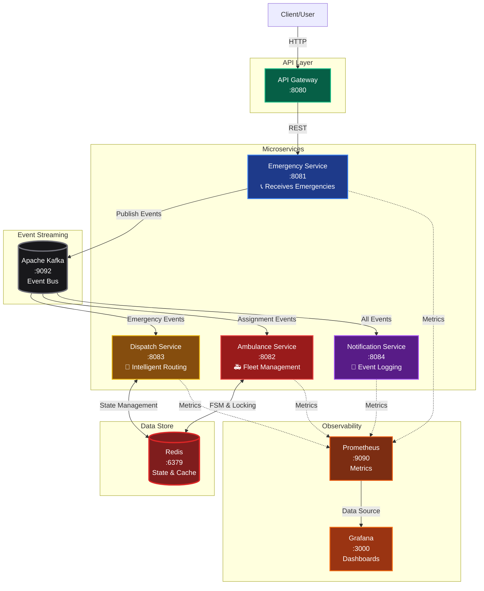
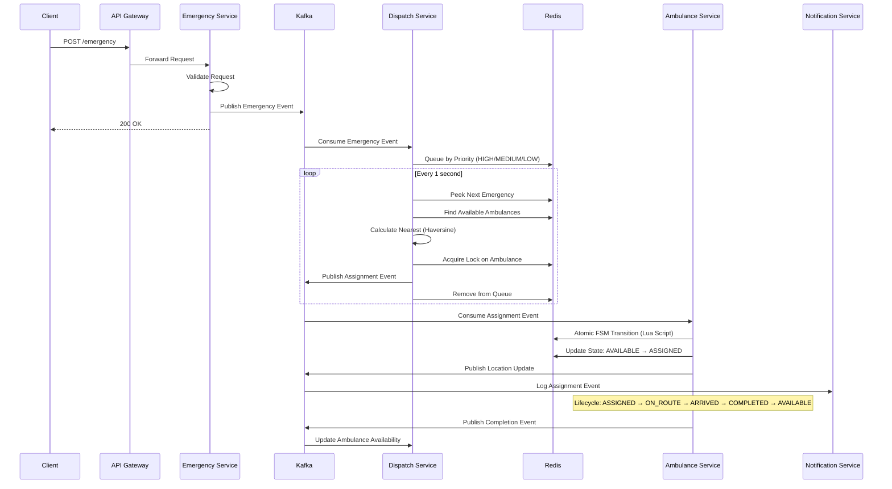
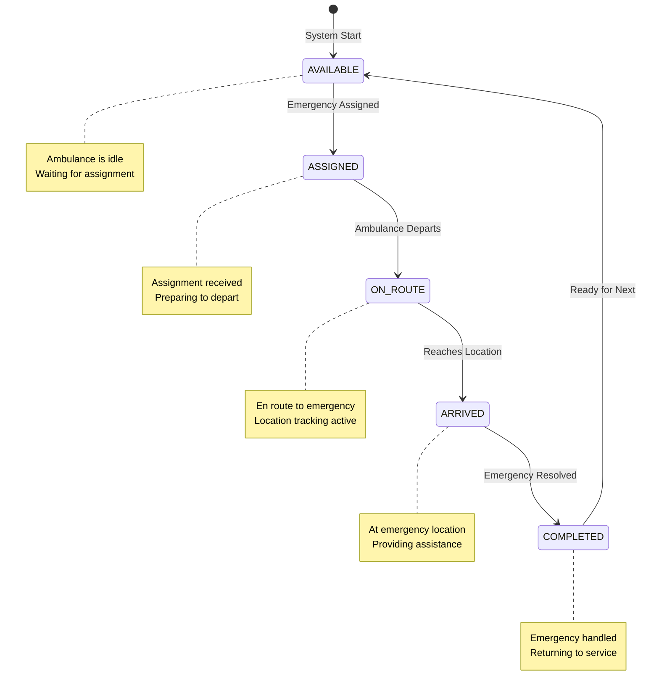
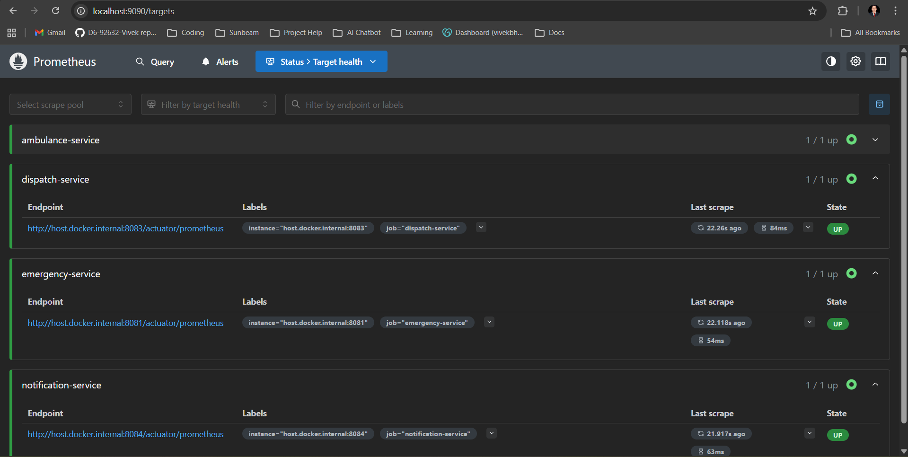

# 🚑 Emergency Dispatch System

> A production-grade, event-driven microservices system for real-time emergency dispatch and ambulance coordination

[](https://www.oracle.com/java/)
[](https://spring.io/projects/spring-boot)
[](https://kafka.apache.org/)
[](https://redis.io/)
[](https://www.docker.com/)


A production-grade, event-driven microservices system for real-time emergency dispatch and ambulance coordination. Built with Spring Boot, Apache Kafka, Redis, and comprehensive observability using Prometheus and Grafana.

## 📋 Table of Contents

- [Overview](#overview)
- [Architecture](#architecture)
- [Key Features](#key-features)
- [Technology Stack](#technology-stack)
- [System Design](#system-design)
- [Getting Started](#getting-started)
- [API Documentation](#api-documentation)
- [Monitoring & Observability](#monitoring--observability)
- [Load Testing](#load-testing)
- [Project Structure](#project-structure)

## 🎯 Overview

This system simulates a real-world emergency dispatch platform that:
- Receives emergency requests with location and priority
- Maintains real-time ambulance location tracking
- Dispatches the nearest available ambulance using intelligent algorithms
- Manages ambulance state through a robust finite state machine (FSM)
- Provides real-time notifications and comprehensive monitoring

## 🏗️ Architecture

The system follows a microservices architecture with event-driven communication:



### Microservices

1. **Emergency Service** (Port 8081)
   - Receives emergency requests via REST API
   - Validates and publishes events to Kafka
   - Entry point for all emergency calls

2. **Dispatch Service** (Port 8083)
   - Consumes emergency events from Kafka
   - Implements priority-based queueing (HIGH, MEDIUM, LOW)
   - Calculates nearest available ambulance using Haversine formula
   - Manages distributed locking for ambulance assignment
   - Publishes assignment events

3. **Ambulance Service** (Port 8082)
   - Manages ambulance fleet state machine
   - Tracks ambulance locations with periodic updates
   - Handles assignment lifecycle: AVAILABLE → ASSIGNED → ON_ROUTE → ARRIVED → COMPLETED
   - Implements optimistic locking with version control
   - Auto-healing for stuck/stale assignments

4. **Notification Service** (Port 8084)
   - Consumes all events for logging and notifications
   - Provides audit trail of system activities

5. **API Gateway** (Port 8080)
   - Single entry point for external clients
   - Routes requests to appropriate services

## ✨ Key Features

### 1. Event-Driven Architecture
- Asynchronous communication via Apache Kafka
- Decoupled services for scalability
- Dead Letter Topic (DLT) handling for failed messages

### 2. Intelligent Dispatch Algorithm
- Priority-based emergency queueing
- Nearest ambulance calculation using Haversine distance formula
- Real-time ambulance availability checking

### 3. Robust State Management
- Redis-based distributed state store
- Finite State Machine (FSM) for ambulance lifecycle
- Optimistic locking with version control
- Atomic operations using Lua scripts

### 4. Fault Tolerance
- Auto-healing for stale assignments (15-minute timeout)
- Stale in-flight recovery (30-minute timeout)
- Orphaned assignment detection
- Distributed lock management with TTL

### 5. Production-Ready Observability
- Prometheus metrics for all services
- Grafana dashboards for visualization
- Custom business metrics:
  - Emergency queue depth
  - Assignment latency
  - Ambulance availability
  - FSM transition tracking
  - Lock acquisition failures

### 6. Load Testing
- PowerShell-based load testing script
- Configurable parallel/sequential execution
- Detailed CSV result reporting

## 🛠️ Technology Stack

### Backend
- **Java 17** - Modern Java features
- **Spring Boot 3.5.11** - Microservices framework
- **Spring Kafka** - Event streaming
- **Spring Data Redis** - State management
- **Spring Actuator** - Health checks and metrics
- **Lombok** - Boilerplate reduction
- **Maven** - Build automation

### Infrastructure
- **Apache Kafka 7.6.0** (KRaft mode) - Event streaming platform
- **Redis 7** - In-memory data store
- **Docker & Docker Compose** - Containerization
- **Prometheus** - Metrics collection
- **Grafana** - Metrics visualization
- **Grafana Image Renderer** - Dashboard rendering

### Patterns & Practices
- Microservices Architecture
- Event-Driven Design
- CQRS (Command Query Responsibility Segregation)
- Finite State Machine (FSM)
- Optimistic Locking
- Circuit Breaker Pattern
- Dead Letter Queue (DLQ)

## 🔧 System Design

### Emergency Flow



### State Machine (Ambulance FSM)



**Auto-Healing Triggers:**
- Orphaned ASSIGNED state (no emergency ID) → Auto-reset to AVAILABLE
- Stale ASSIGNED (>15 minutes) → Auto-reset to AVAILABLE  
- Stale ON_ROUTE/ARRIVED (>30 minutes) → Auto-reset to AVAILABLE

### Data Models

**EmergencyEvent**
```json
{
  "emergencyId": "E12345",
  "lat": 18.5204,
  "lon": 73.8567,
  "priority": "HIGH"
}
```

**AssignmentEvent**
```json
{
  "emergencyId": "E12345",
  "ambulanceId": "A1",
  "distanceKm": 2.5,
  "version": 3
}
```

## 🚀 Getting Started

### Quick Start (Recommended)

Use our quick start scripts for the fastest setup:

**Windows (PowerShell):**
```powershell
.\quick-start.ps1
```

**Linux/Mac (Bash):**
```bash
chmod +x quick-start.sh
./quick-start.sh
```

These scripts will:
- Check prerequisites
- Start all services
- Verify health status
- Display service URLs and helpful commands

### Prerequisites
- Docker & Docker Compose
- Java 17 (for local development)
- Maven 3.8+ (for local development)

### Quick Start

1. **Clone the repository**
   ```bash
   git clone <repository-url>
   cd emergency-dispatch-system
   ```

2. **Start all services**
   ```bash
   docker-compose up -d
   ```

3. **Verify services are running**
   ```bash
   docker-compose ps
   ```

4. **Access the services**
   - API Gateway: http://localhost:8080
   - Emergency Service: http://localhost:8081
   - Ambulance Service: http://localhost:8082
   - Dispatch Service: http://localhost:8083
   - Notification Service: http://localhost:8084
   - Prometheus: http://localhost:9090
   - Grafana: http://localhost:3000

5. **Check health endpoints**
   ```bash
   curl http://localhost:8081/actuator/health
   curl http://localhost:8082/actuator/health
   curl http://localhost:8083/actuator/health
   curl http://localhost:8084/actuator/health
   ```

### Building from Source

```bash
# Build all services
cd emergency-service && mvn clean package && cd ..
cd dispatch-service && mvn clean package && cd ..
cd ambulance-service && mvn clean package && cd ..
cd notification-service && mvn clean package && cd ..
cd api-gateway && mvn clean package && cd ..

# Rebuild and restart with Docker Compose
docker-compose up -d --build
```

## 📡 API Documentation

### Create Emergency

**Endpoint:** `POST /emergency`

**Request Body:**
```json
{
  "emergencyId": "E12345",
  "lat": 18.5204,
  "lon": 73.8567,
  "priority": "HIGH"
}
```

**Validation Rules:**
- `emergencyId`: Required, non-blank
- `lat`: Required, range [-90.0, 90.0]
- `lon`: Required, range [-180.0, 180.0]
- `priority`: Required, one of [HIGH, MEDIUM, LOW]

**Response:**
```
Emergency event sent successfully!
```

**Example:**
```bash
curl -X POST http://localhost:8081/emergency \
  -H "Content-Type: application/json" \
  -d '{
    "emergencyId": "E12345",
    "lat": 18.5204,
    "lon": 73.8567,
    "priority": "HIGH"
  }'
```

For more examples, see [API_EXAMPLES.md](API_EXAMPLES.md)

## 📊 Monitoring & Observability

### Production Dashboard


*Real-time monitoring dashboard showing emergency queue depth, assignment rates, ambulance availability, and system performance metrics*

### Prometheus Metrics



Each service exposes custom metrics at `/actuator/prometheus`:

**Emergency Service**
- `emergency.requests.total` - Total emergency requests received

**Dispatch Service**
- `dispatch.emergencies.queued.total` - Emergencies added to queue
- `dispatch.assignments.published.total` - Successful assignments
- `dispatch.no_available_ambulance.total` - Failed due to no ambulance
- `dispatch.assignment.publish.failures.total` - Kafka publish failures
- `dispatch.assignment.lock.failures.total` - Lock acquisition failures
- `dispatch.assignment.publish.latency` - Assignment publish latency
- `dispatch.emergencies.queue.depth` - Current queue depth
- `dispatch.ambulances.known.count` - Known ambulances
- `dispatch.ambulances.available.count` - Available ambulances

**Ambulance Service**
- `ambulance.fsm.transitions.total` - State transitions by status
- `ambulance.fsm.transition.failures.total` - Failed transitions by reason
- `ambulance.assignment.atomic.applied.total` - Successful atomic assignments
- `ambulance.assignment.atomic.rejected.total` - Rejected atomic assignments
- `ambulance.auto_heal.total` - Auto-healing events by reason

### Grafana Dashboards

Access Grafana at http://localhost:3000 (default credentials: admin/admin)

**Pre-configured Data Source:**
- Prometheus: http://prometheus:9090

**Key Visualizations:**
- Emergency request rate
- Assignment success/failure rates
- Queue depth over time
- Ambulance availability
- FSM transition flows
- System latency percentiles


## 🧪 Load Testing

### Using the PowerShell Script

**Basic Usage:**
```powershell
.\simulate-emergencies.ps1 -Count 50 -DelayMs 200
```

**Parameters:**
- `-BaseUrl`: API endpoint (default: http://localhost:8081/emergency)
- `-Count`: Number of emergencies to create (default: 50)
- `-DelayMs`: Delay between requests in ms (default: 200)
- `-IdPrefix`: Emergency ID prefix (default: ELOAD)
- `-CenterLat`: Center latitude (default: 18.5204)
- `-CenterLon`: Center longitude (default: 73.8567)
- `-Spread`: Coordinate spread (default: 0.02)
- `-Parallel`: Enable parallel execution
- `-Throttle`: Max concurrent requests (default: 10)

**Examples:**

Sequential load test:
```powershell
.\simulate-emergencies.ps1 -Count 100 -DelayMs 100
```

Parallel load test:
```powershell
.\simulate-emergencies.ps1 -Count 100 -Parallel -Throttle 20
```

High-volume stress test:
```powershell
.\simulate-emergencies.ps1 -Count 1000 -Parallel -Throttle 50 -DelayMs 50
```

**Output:**
- Real-time progress in console
- Summary statistics (total, success, failure, avg latency)
- Detailed CSV report: `simulate-emergencies-result-<timestamp>.csv`

## 📁 Project Structure

```
emergency-dispatch-system/
├── emergency-service/          # Emergency request handler
│   ├── src/main/java/com/vivek/emergency/
│   │   ├── controller/        # REST controllers
│   │   ├── dto/              # Data transfer objects
│   │   ├── service/          # Business logic
│   │   └── EmergencyServiceApplication.java
│   ├── src/main/resources/
│   │   └── application.yml
│   ├── Dockerfile
│   └── pom.xml
│
├── dispatch-service/          # Dispatch coordination engine
│   ├── src/main/java/com/vivek/dispatch/
│   │   ├── config/           # Kafka DLT configuration
│   │   ├── dto/              # Event models
│   │   ├── listener/         # Kafka consumers
│   │   ├── service/          # Dispatch algorithm
│   │   └── DispatchServiceApplication.java
│   └── ...
│
├── ambulance-service/         # Ambulance fleet management
│   ├── src/main/java/com/vivek/ambulance/
│   │   ├── config/           # Kafka configuration
│   │   ├── dto/              # Event models
│   │   ├── listener/         # Assignment handlers
│   │   ├── model/            # FSM models
│   │   ├── service/          # State management
│   │   └── AmbulanceServiceApplication.java
│   └── ...
│
├── notification-service/      # Event logging and notifications
│   └── ...
│
├── api-gateway/              # API Gateway
│   └── ...
│
├── monitoring/
│   └── prometheus.yml        # Prometheus configuration
│
├── docker-compose.yml        # Multi-container orchestration
├── simulate-emergencies.ps1  # Load testing script
└── README.md
```

## 🎓 Learning Highlights

This project demonstrates:

1. **Microservices Design Patterns**
   - Service decomposition
   - API Gateway pattern
   - Event-driven architecture
   - Saga pattern for distributed transactions

2. **Distributed Systems Concepts**
   - Event sourcing
   - CQRS
   - Eventual consistency
   - Distributed locking
   - Optimistic concurrency control

3. **Production Engineering**
   - Containerization with Docker
   - Service orchestration
   - Health checks and readiness probes
   - Graceful degradation
   - Auto-healing mechanisms

4. **Observability**
   - Structured logging
   - Custom business metrics
   - Distributed tracing readiness
   - Real-time monitoring

5. **Testing & Quality**
   - Load testing automation
   - Performance benchmarking
   - Failure scenario handling

## 🔮 Future Enhancements

- [ ] Add authentication and authorization
- [ ] Implement distributed tracing (Jaeger/Zipkin)
- [ ] Add database persistence (PostgreSQL)
- [ ] Implement WebSocket for real-time updates
- [ ] Add geofencing capabilities
- [ ] Implement predictive dispatch using ML
- [ ] Add multi-region support
- [ ] Implement rate limiting
- [ ] Add comprehensive integration tests
- [ ] Kubernetes deployment manifests

## 📝 License

This project is licensed under the MIT License - see the [LICENSE](LICENSE) file for details.

## 📚 Additional Documentation

- [Architecture Deep Dive](ARCHITECTURE.md) - Detailed system design and patterns
- [Deployment Guide](DEPLOYMENT.md) - Production deployment instructions
- [Contributing Guidelines](CONTRIBUTING.md) - How to contribute to this project

## 🤝 Contributing

Contributions are welcome! Please read our [Contributing Guidelines](CONTRIBUTING.md) before submitting a Pull Request.

## 👤 Author

**Vivek Bhosale**

- GitHub: [@yourusername](https://github.com/yourusername)
- LinkedIn: [Your LinkedIn](https://linkedin.com/in/yourprofile)

## 🙏 Acknowledgments

- Spring Boot team for the excellent framework
- Apache Kafka for reliable event streaming
- Redis for high-performance state management
- Prometheus & Grafana for observability tools

---

**⭐ If you find this project interesting, please consider giving it a star!**

**💼 This project demonstrates production-ready microservices architecture and is available for technical interviews and portfolio showcases.**
