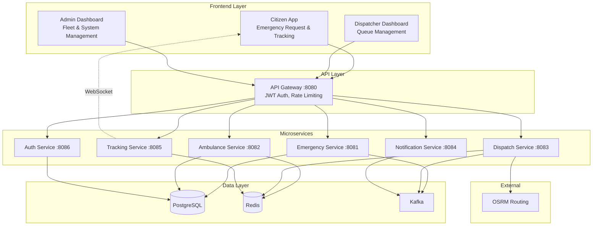
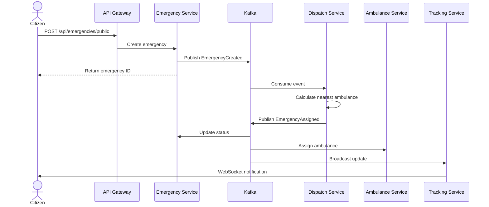
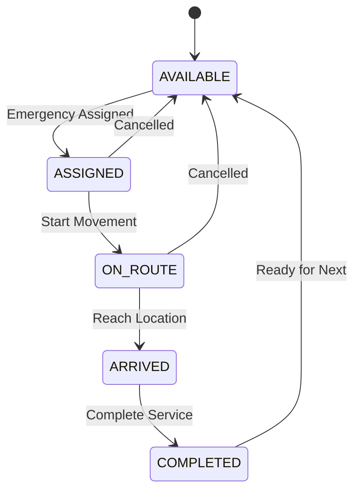

# Emergency Dispatch System

A production-grade microservices-based emergency response platform for rapid ambulance dispatch, real-time tracking, and emergency request management.

## Table of Contents

- [Overview](#overview)
- [Architecture](#architecture)
- [Technology Stack](#technology-stack)
- [Key Features](#key-features)
- [System Design](#system-design)
- [Getting Started](#getting-started)
- [API Endpoints](#api-endpoints)
- [Configuration](#configuration)
- [Troubleshooting](#troubleshooting)
- [Technical Highlights](#technical-highlights)

## Overview

Emergency Dispatch System is a comprehensive solution that reduces ambulance response time through:
- Automated priority-based dispatch
- Real-time fleet tracking and management
- Event-driven microservices architecture
- Resilient and scalable design patterns

## Architecture

### System Overview



### Emergency Request Flow



### Ambulance State Machine



## Technology Stack

### Backend
- **Framework**: Spring Boot 3.x
- **Security**: Spring Security with JWT (RS256)
- **Data Access**: Spring Data JPA
- **Messaging**: Spring Kafka
- **Real-time**: WebSocket with STOMP
- **API Gateway**: Spring Cloud Gateway

### Frontend
- **Framework**: React 18
- **Routing**: React Router
- **Maps**: Leaflet
- **HTTP Client**: Axios
- **Real-time**: WebSocket Client

### Infrastructure
- **Database**: PostgreSQL (transactional data)
- **Cache**: Redis (distributed locks, rate limiting, caching)
- **Message Broker**: Apache Kafka (event streaming)
- **Routing Engine**: OSRM (route calculation)
- **Monitoring**: Prometheus & Grafana
- **Containerization**: Docker & Docker Compose

## Key Features

### Core Functionality
- **Priority-based Dispatch**: Automatic assignment based on emergency priority (HIGH, MEDIUM, LOW)
- **Real-time Tracking**: Live ambulance location updates via WebSocket
- **Smart Routing**: OSRM integration for optimal route calculation
- **State Management**: Finite state machine for ambulance lifecycle
- **Auto-healing**: Automatic recovery for stuck ambulance states

### Design Patterns & Best Practices
- **Transactional Outbox Pattern**: Ensures reliable event publishing
- **Circuit Breaker**: Resilient external service calls
- **Distributed Locking**: Redis-based atomic operations
- **Idempotency**: Prevents duplicate processing
- **CQRS**: Separate read and write models
- **Event Sourcing**: Event-driven architecture with Kafka

### Security
- **Authentication**: JWT with RS256 algorithm
- **Authorization**: Role-based access control (ADMIN, DISPATCHER, AMBULANCE_DRIVER)
- **Token Management**: Refresh token rotation
- **Rate Limiting**: Distributed rate limiting at gateway level
- **API Security**: Gateway-enforced token validation

### Observability
- **Health Checks**: Liveness and readiness probes
- **Metrics**: Prometheus integration with custom metrics
- **Logging**: Structured logging with correlation IDs
- **Monitoring**: Grafana dashboards for system visualization
- **Tracing**: Request correlation across microservices

## System Design

### Microservices

| Service | Port | Responsibility |
|---------|------|----------------|
| **API Gateway** | 8080 | Request routing, authentication, rate limiting |
| **Auth Service** | 8086 | User authentication, JWT token management |
| **Emergency Service** | 8081 | Emergency lifecycle management, outbox pattern |
| **Dispatch Service** | 8083 | Priority queue, ambulance assignment logic |
| **Ambulance Service** | 8082 | Fleet state machine, movement simulation |
| **Tracking Service** | 8085 | Location ingestion, WebSocket broadcasting |
| **Notification Service** | 8084 | Event consumption, webhook notifications |

### Data Stores

- **PostgreSQL**: Persistent storage for emergencies, ambulances, users, and assignments
- **Redis**: Distributed state, queues, locks, rate limiting, and caching
- **Kafka**: Event backbone for inter-service communication

## Getting Started

### Prerequisites
- Java 17+
- Maven 3.8+
- Node.js 16+
- Docker & Docker Compose

### Installation

1. **Clone the repository**
```bash
git clone https://github.com/bhosalevivek04/Emergency-Dispatch-System.git
cd Emergency-Dispatch-System
```

2. **Configure environment**
```bash
cp .env.example .env
# Edit .env with your configuration
```

3. **Start infrastructure services**
```bash
docker-compose up -d postgres redis kafka zookeeper osrm-pune
```

4. **Start backend services** (in separate terminals)
```bash
# Start in this order
cd emergency-service && mvn spring-boot:run
cd ambulance-service && mvn spring-boot:run
cd dispatch-service && mvn spring-boot:run
cd tracking-service && mvn spring-boot:run
cd notification-service && mvn spring-boot:run
cd auth-service && mvn spring-boot:run
cd api-gateway && mvn spring-boot:run
```

5. **Start frontend**
```bash
cd tracking-client
npm install
npm start
```

### Access Points

- **Citizen App**: http://localhost:3002/citizen
- **Dispatcher Dashboard**: http://localhost:3002/dispatcher
- **Admin Dashboard**: http://localhost:3002/admin
- **API Gateway**: http://localhost:8080
- **Grafana**: http://localhost:3001 (admin/admin)
- **Prometheus**: http://localhost:9090

## API Endpoints

### Authentication
```
POST   /auth/login          # User login
POST   /auth/refresh        # Refresh access token
POST   /auth/logout         # User logout
```

### Public Endpoints (No Auth Required)
```
POST   /api/emergencies/public                    # Create emergency
GET    /api/emergencies/public/{id}               # Get emergency details
GET    /api/tracking/public/ambulances/{id}       # Track ambulance
```

### Protected Endpoints (Auth Required)
```
GET    /api/emergencies                           # List all emergencies
GET    /api/emergencies/{id}                      # Get emergency by ID
PUT    /api/emergencies/{id}/status               # Update emergency status

GET    /api/ambulances                            # List all ambulances
GET    /api/ambulances/{id}                       # Get ambulance by ID
PUT    /api/ambulances/{id}/status                # Update ambulance status

GET    /api/dispatch/queue                        # View dispatch queue
POST   /api/dispatch/assign                       # Manual assignment

GET    /api/tracking/ambulances/{id}/location     # Get ambulance location
```

### Health & Monitoring
```
GET    /actuator/health                           # Overall health
GET    /actuator/health/liveness                  # Liveness probe
GET    /actuator/health/readiness                 # Readiness probe
GET    /actuator/prometheus                       # Prometheus metrics
```

## Configuration

### Environment Variables

Create a `.env` file in the root directory:

```env
# Database
POSTGRES_HOST=localhost
POSTGRES_PORT=5432
POSTGRES_DB=emergency_dispatch
POSTGRES_USER=postgres
POSTGRES_PASSWORD=postgres

# Redis
REDIS_HOST=localhost
REDIS_PORT=6379

# Kafka
KAFKA_BOOTSTRAP_SERVERS=localhost:9092

# OSRM
OSRM_URL=http://localhost:5000

# Notifications
WEBHOOK_URL=https://webhook.site/your-unique-url
WEBHOOK_ENABLED=true

# JWT
JWT_SECRET=your-secret-key
JWT_EXPIRATION=900000
JWT_REFRESH_EXPIRATION=604800000
```

## Troubleshooting

### Services won't start
- Verify all infrastructure services are running: `docker-compose ps`
- Check port availability: `netstat -ano | findstr :8080`
- Verify Java version: `java -version` (must be 17+)

### No ambulance assigned
- Check dispatch-service logs for errors
- Verify Redis queue: `redis-cli LRANGE dispatch:emergency:queue 0 -1`
- Ensure OSRM is accessible: `curl http://localhost:5000/health`
- Confirm Kafka is running: `docker-compose logs kafka`

### WebSocket not connecting
- Verify tracking-service is running on port 8085
- Check browser console for connection errors
- Ensure API Gateway is properly routing WebSocket requests

### Database connection errors
- Verify PostgreSQL container: `docker-compose ps postgres`
- Check credentials in `.env` file
- Ensure database exists: `docker-compose exec postgres psql -U postgres -l`

## Technical Highlights

### Architecture & Design
- **Microservices Architecture**: 7 independent services with clear boundaries
- **Event-Driven Design**: Asynchronous communication via Kafka
- **Domain-Driven Design**: Clear service boundaries and responsibilities
- **API Gateway Pattern**: Centralized routing and security

### Reliability & Resilience
- **Transactional Outbox**: Guarantees event delivery
- **Circuit Breaker**: Prevents cascade failures
- **Distributed Locking**: Ensures atomic operations
- **Auto-healing**: Automatic recovery mechanisms
- **Idempotency**: Safe retry logic

### Performance & Scalability
- **Caching Strategy**: Redis for frequently accessed data
- **Connection Pooling**: Optimized database connections
- **Async Processing**: Non-blocking operations
- **Horizontal Scaling**: Stateless service design

### Security
- **JWT Authentication**: Industry-standard token-based auth
- **Role-Based Access Control**: Fine-grained permissions
- **Rate Limiting**: Protection against abuse
- **Secure Communication**: HTTPS ready

### Observability
- **Health Probes**: Kubernetes-ready health checks
- **Metrics Collection**: Prometheus integration
- **Distributed Tracing**: Correlation ID propagation
- **Structured Logging**: JSON-formatted logs

### Development Practices
- **Clean Code**: SOLID principles
- **Design Patterns**: Factory, Strategy, Observer, State Machine
- **Error Handling**: Comprehensive exception management
- **API Documentation**: Clear endpoint specifications

## Project Statistics

- **Microservices**: 7 independent services
- **API Endpoints**: 40+ RESTful endpoints
- **Design Patterns**: 10+ enterprise patterns
- **Technologies**: 15+ modern technologies
- **Lines of Code**: 15,000+ well-structured code
- **Real-time Channels**: WebSocket with STOMP

## License

This project is licensed under the MIT License.

## Contact

- **GitHub**: [bhosalevivek04](https://github.com/bhosalevivek04)
- **Repository**: [Emergency-Dispatch-System](https://github.com/bhosalevivek04/Emergency-Dispatch-System)

---

**Built with modern technologies and enterprise-grade patterns for production readiness.**
